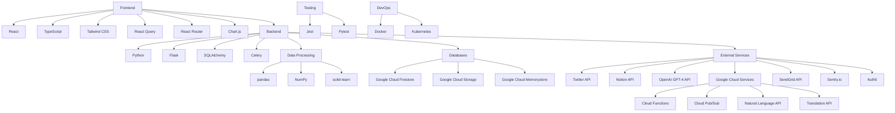

## REPOSITORY STRUCTURE

### OVERVIEW

This repository contains the codebase for the Code Skeptic Scanner, a cloud-based solution that monitors Twitter/X in real-time for skeptical or negative opinions about AI coding tools. The project is structured into frontend, backend, and infrastructure components, with additional directories for scripts, GitHub workflows, and documentation.

### STRUCTURE MAP

```
code-skeptic-scanner/
├── frontend/
│   ├── public/
│   │   └── index.html
│   ├── src/
│   │   ├── components/
│   │   │   ├── Dashboard.tsx
│   │   │   ├── TweetAnalysis.tsx
│   │   │   ├── ResponseManagement.tsx
│   │   │   ├── Settings.tsx
│   │   │   └── Analytics.tsx
│   │   ├── pages/
│   │   │   ├── Home.tsx
│   │   │   ├── TweetView.tsx
│   │   │   ├── ResponseView.tsx
│   │   │   └── SettingsPage.tsx
│   │   ├── services/
│   │   │   ├── api.ts
│   │   │   ├── twitterService.ts
│   │   │   └── notionService.ts
│   │   ├── store/
│   │   │   ├── index.ts
│   │   │   ├── tweetSlice.ts
│   │   │   └── responseSlice.ts
│   │   ├── utils/
│   │   │   ├── formatters.ts
│   │   │   └── validators.ts
│   │   ├── schema/
│   │   │   ├── tweet.ts
│   │   │   └── response.ts
│   │   ├── app.tsx
│   │   └── index.tsx
│   ├── package.json
│   └── tsconfig.json
├── backend/
│   ├── app/
│   │   ├── api/
│   │   │   ├── tweets.py
│   │   │   ├── responses.py
│   │   │   ├── settings.py
│   │   │   └── analytics.py
│   │   ├── core/
│   │   │   ├── config.py
│   │   │   └── security.py
│   │   ├── db/
│   │   │   ├── models.py
│   │   │   └── database.py
│   │   ├── services/
│   │   │   ├── twitter_service.py
│   │   │   ├── notion_service.py
│   │   │   ├── llm_service.py
│   │   │   └── sentiment_analysis.py
│   │   ├── tasks/
│   │   │   ├── tweet_monitoring.py
│   │   │   └── response_generation.py
│   │   ├── schema/
│   │   │   ├── tweet.py
│   │   │   └── response.py
│   │   └── main.py
│   └── tests/
│       ├── test_api.py
│       ├── test_services.py
│       └── test_tasks.py
├── infrastructure/
│   ├── terraform/
│   │   ├── main.tf
│   │   ├── variables.tf
│   │   └── outputs.tf
│   └── docker/
│       ├── Dockerfile.frontend
│       └── Dockerfile.backend
├── scripts/
│   ├── setup_environment.sh
│   └── deploy.sh
├── .github/
│   └── workflows/
│       ├── ci.yml
│       └── cd.yml
├── .gitignore
└── README.md
```

This structure map organizes the Code Skeptic Scanner project into logical modules and sub-modules, represented by folders and files. The structure is designed to accommodate all the features and requirements specified in the technical specification.

The `frontend` directory contains the React application with TypeScript, including components for the dashboard, tweet analysis, response management, settings, and analytics. The `backend` directory houses the Python-based Flask application, including API endpoints, core functionality, database models, services for external integrations, and background tasks.

The `infrastructure` directory includes Terraform configurations for provisioning cloud resources and Dockerfiles for containerizing the application. The `scripts` directory contains utility scripts for setup and deployment.

The `.github` directory includes CI/CD workflows for automated testing and deployment. The root directory contains the `.gitignore` file for specifying ignored files and directories, and the `README.md` file for project documentation.

This structure provides a comprehensive and organized foundation for implementing the Code Skeptic Scanner as specified in the technical requirements.

# BACKEND

## SCHEMA

```json
{
    "backend/app/schema": {
        "tweet.py": {
            "description": "Defines the schema for tweet data",
            "imports": [
                {"pydantic": "BaseModel"},
                {"typing": "List, Optional"}
            ],
            "classes": [
                {
                    "Tweet": {
                        "description": "Pydantic model for tweet data",
                        "properties": [
                            {"str": "id"},
                            {"str": "content"},
                            {"int": "like_count"},
                            {"datetime": "created_at"},
                            {"float": "doubt_rating"},
                            {"List[str]": "media"},
                            {"Optional[str]": "quoted_tweet_id"},
                            {"str": "user_id"},
                            {"List[str]": "ai_tools_mentioned"}
                        ],
                        "dependencies": {
                            "external": [
                                {
                                    "name": "BaseModel",
                                    "module": "pydantic"
                                }
                            ]
                        },
                        "confidence": 0.9
                    }
                }
            ]
        },
        "response.py": {
            "description": "Defines the schema for response data",
            "imports": [
                {"pydantic": "BaseModel"},
                {"datetime": "datetime"}
            ],
            "classes": [
                {
                    "Response": {
                        "description": "Pydantic model for response data",
                        "properties": [
                            {"str": "id"},
                            {"str": "content"},
                            {"datetime": "generated_at"},
                            {"bool": "is_approved"},
                            {"str": "tweet_id"}
                        ],
                        "dependencies": {
                            "external": [
                                {
                                    "name": "BaseModel",
                                    "module": "pydantic"
                                }
                            ]
                        },
                        "confidence": 0.9
                    }
                }
            ]
        }
    }
}
```

This JSON representation defines the schema for the backend of the Code Skeptic Scanner. It includes two main files: `tweet.py` and `response.py`, both located in the `backend/app/schema` directory.

The `tweet.py` file contains a `Tweet` class that represents the structure of a tweet, including properties such as `id`, `content`, `like_count`, `doubt_rating`, and others as specified in the technical requirements. It uses Pydantic's `BaseModel` for data validation and serialization.

The `response.py` file defines a `Response` class that represents the structure of a generated response, including properties like `id`, `content`, `generated_at`, `is_approved`, and `tweet_id`. This class also uses Pydantic's `BaseModel`.

Both classes have a high confidence score (0.9) as they are relatively straightforward data models without complex logic or extensive dependencies. The main external dependency for both is the Pydantic library, which is commonly used for data validation in Python applications.

These schema definitions will be crucial for ensuring data consistency throughout the application, particularly when interacting with the database and API endpoints.

## BACKEND API

```json
{
    "backend/app/api": {
        "tweets.py": {
            "description": "API endpoints for tweet-related operations",
            "imports": [
                {"flask": "Blueprint, request, jsonify"},
                {"flask_jwt_extended": "jwt_required"},
                {"app.services.twitter_service": "TwitterService"},
                {"app.services.sentiment_analysis": "SentimentAnalysis"},
                {"app.schema.tweet": "Tweet"}
            ],
            "globals": [
                {"tweets_bp": "Blueprint('tweets', __name__)"}
            ],
            "functions": [
                {
                    "get_tweets": {
                        "description": "Retrieve tweets with pagination",
                        "parameters": [
                            {"int": "page"},
                            {"int": "per_page"}
                        ],
                        "returns": {
                            "dict": "JSON response containing tweets and pagination info"
                        },
                        "decorators": ["@tweets_bp.route('/tweets', methods=['GET'])", "@jwt_required"],
                        "dependencies": {
                            "internal": [
                                {
                                    "name": "TwitterService",
                                    "module": "app/services/twitter_service.py"
                                }
                            ],
                            "external": [
                                {
                                    "name": "jsonify",
                                    "module": "flask"
                                }
                            ]
                        },
                        "steps": [
                            "Extract page and per_page parameters from request",
                            "Call TwitterService to fetch paginated tweets",
                            "Return JSON response with tweets and pagination info"
                        ],
                        "confidence": 0.8
                    }
                },
                {
                    "get_tweet": {
                        "description": "Retrieve a specific tweet by ID",
                        "parameters": [
                            {"str": "tweet_id"}
                        ],
                        "returns": {
                            "dict": "JSON response containing tweet data"
                        },
                        "decorators": ["@tweets_bp.route('/tweets/<tweet_id>', methods=['GET'])", "@jwt_required"],
                        "dependencies": {
                            "internal": [
                                {
                                    "name": "TwitterService",
                                    "module": "app/services/twitter_service.py"
                                }
                            ],
                            "external": [
                                {
                                    "name": "jsonify",
                                    "module": "flask"
                                }
                            ]
                        },
                        "steps": [
                            "Extract tweet_id from URL parameter",
                            "Call TwitterService to fetch specific tweet",
                            "Return JSON response with tweet data"
                        ],
                        "confidence": 0.9
                    }
                },
                {
                    "analyze_tweet": {
                        "description": "Trigger analysis for a specific tweet",
                        "parameters": [
                            {"str": "tweet_id"}
                        ],
                        "returns": {
                            "dict": "JSON response containing analysis results"
                        },
                        "decorators": ["@tweets_bp.route('/tweets/<tweet_id>/analyze', methods=['POST'])", "@jwt_required"],
                        "dependencies": {
                            "internal": [
                                {
                                    "name": "TwitterService",
                                    "module": "app/services/twitter_service.py"
                                },
                                {
                                    "name": "SentimentAnalysis",
                                    "module": "app/services/sentiment_analysis.py"
                                }
                            ],
                            "external": [
                                {
                                    "name": "jsonify",
                                    "module": "flask"
                                }
                            ]
                        },
                        "steps": [
                            "Extract tweet_id from URL parameter",
                            "Call TwitterService to fetch tweet content",
                            "Use SentimentAnalysis to analyze tweet content",
                            "Update tweet with analysis results",
                            "Return JSON response with analysis results"
                        ],
                        "confidence": 0.7
                    }
                }
            ]
        },
        "responses.py": {
            "description": "API endpoints for response-related operations",
            "imports": [
                {"flask": "Blueprint, request, jsonify"},
                {"flask_jwt_extended": "jwt_required"},
                {"app.services.response_service": "ResponseService"},
                {"app.schema.response": "Response"}
            ],
            "globals": [
                {"responses_bp": "Blueprint('responses', __name__)"}
            ],
            "functions": [
                {
                    "get_responses": {
                        "description": "Retrieve generated responses with pagination",
                        "parameters": [
                            {"int": "page"},
                            {"int": "per_page"}
                        ],
                        "returns": {
                            "dict": "JSON response containing responses and pagination info"
                        },
                        "decorators": ["@responses_bp.route('/responses', methods=['GET'])", "@jwt_required"],
                        "dependencies": {
                            "internal": [
                                {
                                    "name": "ResponseService",
                                    "module": "app/services/response_service.py"
                                }
                            ],
                            "external": [
                                {
                                    "name": "jsonify",
                                    "module": "flask"
                                }
                            ]
                        },
                        "steps": [
                            "Extract page and per_page parameters from request",
                            "Call ResponseService to fetch paginated responses",
                            "Return JSON response with responses and pagination info"
                        ],
                        "confidence": 0.8
                    }
                },
                {
                    "get_response": {
                        "description": "Retrieve a specific response by ID",
                        "parameters": [
                            {"str": "response_id"}
                        ],
                        "returns": {
                            "dict": "JSON response containing response data"
                        },
                        "decorators": ["@responses_bp.route('/responses/<response_id>', methods=['GET'])", "@jwt_required"],
                        "dependencies": {
                            "internal": [
                                {
                                    "name": "ResponseService",
                                    "module": "app/services/response_service.py"
                                }
                            ],
                            "external": [
                                {
                                    "name": "jsonify",
                                    "module": "flask"
                                }
                            ]
                        },
                        "steps": [
                            "Extract response_id from URL parameter",
                            "Call ResponseService to fetch specific response",
                            "Return JSON response with response data"
                        ],
                        "confidence": 0.9
                    }
                },
                {
                    "generate_response": {
                        "description": "Generate a new response for a tweet",
                        "parameters": [
                            {"str": "tweet_id"}
                        ],
                        "returns": {
                            "dict": "JSON response containing generated response data"
                        },
                        "decorators": ["@responses_bp.route('/responses', methods=['POST'])", "@jwt_required"],
                        "dependencies": {
                            "internal": [
                                {
                                    "name": "ResponseService",
                                    "module": "app/services/response_service.py"
                                }
                            ],
                            "external": [
                                {
                                    "name": "jsonify",
                                    "module": "flask"
                                },
                                {
                                    "name": "request",
                                    "module": "flask"
                                }
                            ]
                        },
                        "steps": [
                            "Extract tweet_id from request JSON",
                            "Call ResponseService to generate new response",
                            "Return JSON response with generated response data"
                        ],
                        "confidence": 0.7
                    }
                },
                {
                    "update_response": {
                        "description": "Update a response (e.g., approve/reject)",
                        "parameters": [
                            {"str": "response_id"}
                        ],
                        "returns": {
                            "dict": "JSON response containing updated response data"
                        },
                        "decorators": ["@responses_bp.route('/responses/<response_id>', methods=['PUT'])", "@jwt_required"],
                        "dependencies": {
                            "internal": [
                                {
                                    "name": "ResponseService",
                                    "module": "app/services/response_service.py"
                                }
                            ],
                            "external": [
                                {
                                    "name": "jsonify",
                                    "module": "flask"
                                },
                                {
                                    "name": "request",
                                    "module": "flask"
                                }
                            ]
                        },
                        "steps": [
                            "Extract response_id from URL parameter",
                            "Extract update data from request JSON",
                            "Call ResponseService to update response",
                            "Return JSON response with updated response data"
                        ],
                        "confidence": 0.8
                    }
                }
            ]
        },
        "settings.py": {
            "description": "API endpoints for settings management",
            "imports": [
                {"flask": "Blueprint, request, jsonify"},
                {"flask_jwt_extended": "jwt_required"},
                {"app.services.settings_service": "SettingsService"}
            ],
            "globals": [
                {"settings_bp": "Blueprint('settings', __name__)"}
            ],
            "functions": [
                {
                    "get_settings": {
                        "description": "Retrieve all settings",
                        "parameters": [],
                        "returns": {
                            "dict": "JSON response containing all settings"
                        },
                        "decorators": ["@settings_bp.route('/settings', methods=['GET'])", "@jwt_required"],
                        "dependencies": {
                            "internal": [
                                {
                                    "name": "SettingsService",
                                    "module": "app/services/settings_service.py"
                                }
                            ],
                            "external": [
                                {
                                    "name": "jsonify",
                                    "module": "flask"
                                }
                            ]
                        },
                        "steps": [
                            "Call SettingsService to fetch all settings",
                            "Return JSON response with settings data"
                        ],
                        "confidence": 0.9
                    }
                },
                {
                    "update_setting": {
                        "description": "Update a specific setting",
                        "parameters": [
                            {"str": "key"}
                        ],
                        "returns": {
                            "dict": "JSON response containing updated setting"
                        },
                        "decorators": ["@settings_bp.route('/settings/<key>', methods=['PUT'])", "@jwt_required"],
                        "dependencies": {
                            "internal": [
                                {
                                    "name": "SettingsService",
                                    "module": "app/services/settings_service.py"
                                }
                            ],
                            "external": [
                                {
                                    "name": "jsonify",
                                    "module": "flask"
                                },
                                {
                                    "name": "request",
                                    "module": "flask"
                                }
                            ]
                        },
                        "steps": [
                            "Extract key from URL parameter",
                            "Extract new value from request JSON",
                            "Call SettingsService to update setting",
                            "Return JSON response with updated setting data"
                        ],
                        "confidence": 0.8
                    }
                }
            ]
        },
        "analytics.py": {
            "description": "API endpoints for analytics data",
            "imports": [
                {"flask": "Blueprint, jsonify"},
                {"flask_jwt_extended": "jwt_required"},
                {"app.services.analytics_service": "AnalyticsService"}
            ],
            "globals": [
                {"analytics_bp": "Blueprint('analytics', __name__)"}
            ],
            "functions": [
                {
                    "get_trends": {
                        "description": "Retrieve trend data",
                        "parameters": [],
                        "returns": {
                            "dict": "JSON response containing trend data"
                        },
                        "decorators": ["@analytics_bp.route('/analytics/trends', methods=['GET'])", "@jwt_required"],
                        "dependencies": {
                            "internal": [
                                {
                                    "name": "AnalyticsService",
                                    "module": "app/services/analytics_service.py"
                                }
                            ],
                            "external": [
                                {
                                    "name": "jsonify",
                                    "module": "flask"
                                }
                            ]
                        },
                        "steps": [
                            "Call AnalyticsService to fetch trend data",
                            "Return JSON response with trend data"
                        ],
                        "confidence": 0.7
                    }
                },
                {
                    "get_summary": {
                        "description": "Retrieve summary statistics",
                        "parameters": [],
                        "returns": {
                            "dict": "JSON response containing summary statistics"
                        },
                        "decorators": ["@analytics_bp.route('/analytics/summary', methods=['GET'])", "@jwt_required"],
                        "dependencies": {
                            "internal": [
                                {
                                    "name": "AnalyticsService",
                                    "module": "app/services/analytics_service.py"
                                }
                            ],
                            "external": [
                                {
                                    "name": "jsonify",
                                    "module": "flask"
                                }
                            ]
                        },
                        "steps": [
                            "Call AnalyticsService to fetch summary statistics",
                            "Return JSON response with summary data"
                        ],
                        "confidence": 0.7
                    }
                }
            ]
        }
    }
}
```

This JSON representation outlines the structure and content of the API endpoints for the Code Skeptic Scanner backend. It includes four main API modules: tweets, responses, settings, and analytics. Each module contains relevant endpoints for handling specific functionalities of the application.

The structure follows the RESTful API design principles, with clear separation of concerns between different resources. The use of Flask blueprints allows for modular organization of the API endpoints.

Each endpoint is described with its purpose, parameters, return values, decorators (including JWT authentication), dependencies (both internal and external), and a series of steps outlining the general flow of the function. The confidence scores provided indicate the relative complexity of implementing each endpoint, with lower scores suggesting more complex operations or dependencies on external services.

This API structure aligns with the requirements outlined in the technical specification, providing endpoints for tweet retrieval and analysis, response generation and management, settings configuration, and analytics data retrieval. The use of JWT authentication ensures secure access to these endpoints.

## BACKEND CORE

```json
{
    "backend/app/core": {
        "config.py": {
            "description": "Configuration management for the Code Skeptic Scanner",
            "imports": [
                {"os": "getenv"},
                {"pydantic": "BaseSettings"}
            ],
            "classes": [
                {
                    "Settings": {
                        "description": "Application settings using Pydantic BaseSettings",
                        "properties": [
                            {"str": "TWITTER_API_KEY"},
                            {"str": "TWITTER_API_SECRET"},
                            {"str": "NOTION_API_KEY"},
                            {"str": "OPENAI_API_KEY"},
                            {"str": "DATABASE_URL"},
                            {"int": "TWEET_POPULARITY_THRESHOLD"},
                            {"int": "RESPONSE_GENERATION_DELAY"}
                        ],
                        "dependencies": {
                            "external": [
                                {
                                    "name": "BaseSettings",
                                    "module": "pydantic"
                                }
                            ]
                        },
                        "constructor": {
                            "description": "Initializes Settings with environment variables",
                            "steps": [
                                "Load environment variables",
                                "Set default values for optional settings"
                            ]
                        },
                        "confidence": 0.9
                    }
                }
            ],
            "functions": [
                {
                    "get_settings": {
                        "description": "Retrieves application settings",
                        "returns": {
                            "Settings": "Application settings instance"
                        },
                        "steps": [
                            "Create and return a Settings instance"
                        ],
                        "confidence": 0.95
                    }
                }
            ]
        },
        "security.py": {
            "description": "Security-related functions and utilities",
            "imports": [
                {"jwt": "encode, decode"},
                {"datetime": "datetime, timedelta"},
                {"passlib.hash": "bcrypt"},
                {"app.core.config": "get_settings"}
            ],
            "functions": [
                {
                    "create_access_token": {
                        "description": "Creates a JWT access token",
                        "parameters": [
                            {"dict": "data"},
                            {"timedelta": "expires_delta"}
                        ],
                        "returns": {
                            "str": "Encoded JWT token"
                        },
                        "dependencies": {
                            "internal": [
                                {
                                    "name": "get_settings",
                                    "module": "app/core/config.py"
                                }
                            ],
                            "external": [
                                {
                                    "name": "encode",
                                    "module": "jwt"
                                },
                                {
                                    "name": "datetime",
                                    "module": "datetime"
                                },
                                {
                                    "name": "timedelta",
                                    "module": "datetime"
                                }
                            ]
                        },
                        "steps": [
                            "Get application settings",
                            "Create token data with expiration",
                            "Encode and return JWT token"
                        ],
                        "confidence": 0.8
                    }
                },
                {
                    "verify_password": {
                        "description": "Verifies a password against a hash",
                        "parameters": [
                            {"str": "plain_password"},
                            {"str": "hashed_password"}
                        ],
                        "returns": {
                            "bool": "True if password is valid, False otherwise"
                        },
                        "dependencies": {
                            "external": [
                                {
                                    "name": "bcrypt",
                                    "module": "passlib.hash"
                                }
                            ]
                        },
                        "steps": [
                            "Use bcrypt to verify the plain password against the hash"
                        ],
                        "confidence": 0.9
                    }
                },
                {
                    "get_password_hash": {
                        "description": "Generates a password hash",
                        "parameters": [
                            {"str": "password"}
                        ],
                        "returns": {
                            "str": "Hashed password"
                        },
                        "dependencies": {
                            "external": [
                                {
                                    "name": "bcrypt",
                                    "module": "passlib.hash"
                                }
                            ]
                        },
                        "steps": [
                            "Use bcrypt to generate a hash of the password"
                        ],
                        "confidence": 0.9
                    }
                }
            ]
        }
    }
}
```

This JSON representation describes the core components of the backend for the Code Skeptic Scanner. It includes two main files: `config.py` and `security.py`, both located in the `backend/app/core` directory.

The `config.py` file contains a `Settings` class that manages the application's configuration using Pydantic's `BaseSettings`. It includes properties for various API keys, database URL, and other configurable parameters. The `get_settings` function provides a convenient way to retrieve the application settings.

The `security.py` file includes functions for handling JWT token creation, password verification, and password hashing. These functions are crucial for implementing the authentication and authorization system described in the Security Considerations section of the technical specification.

Both files have relatively high confidence scores, as they implement common patterns and utilize well-established libraries. However, the `create_access_token` function has a slightly lower confidence score due to its dependency on external configurations and potential for customization based on specific security requirements.

## Backend DB

```json
{
    "backend/app/db": {
        "models.py": {
            "description": "Defines the database models for the Code Skeptic Scanner",
            "imports": [
                {"sqlalchemy": "Column, Integer, String, DateTime, Float, Boolean, ForeignKey"},
                {"sqlalchemy.orm": "relationship"},
                {"sqlalchemy.ext.declarative": "declarative_base"}
            ],
            "globals": [
                {"Base": "declarative_base()"}
            ],
            "classes": [
                {
                    "Tweet": {
                        "description": "Model representing a tweet in the database",
                        "properties": [
                            {"Integer": "id"},
                            {"String": "content"},
                            {"Integer": "like_count"},
                            {"DateTime": "created_at"},
                            {"Float": "doubt_rating"},
                            {"String": "media"},
                            {"String": "quoted_tweet_id"},
                            {"String": "user_id"},
                            {"String": "ai_tools_mentioned"}
                        ],
                        "dependencies": {
                            "external": [
                                {
                                    "name": "Column",
                                    "module": "sqlalchemy"
                                }
                            ]
                        },
                        "confidence": 0.9
                    }
                },
                {
                    "Response": {
                        "description": "Model representing a generated response in the database",
                        "properties": [
                            {"Integer": "id"},
                            {"String": "content"},
                            {"DateTime": "generated_at"},
                            {"Boolean": "is_approved"},
                            {"Integer": "tweet_id"},
                            {"relationship": "tweet"}
                        ],
                        "dependencies": {
                            "external": [
                                {
                                    "name": "Column",
                                    "module": "sqlalchemy"
                                },
                                {
                                    "name": "relationship",
                                    "module": "sqlalchemy.orm"
                                }
                            ]
                        },
                        "confidence": 0.9
                    }
                },
                {
                    "AITool": {
                        "description": "Model representing an AI tool in the database",
                        "properties": [
                            {"Integer": "id"},
                            {"String": "name"},
                            {"String": "description"}
                        ],
                        "dependencies": {
                            "external": [
                                {
                                    "name": "Column",
                                    "module": "sqlalchemy"
                                }
                            ]
                        },
                        "confidence": 0.95
                    }
                },
                {
                    "Setting": {
                        "description": "Model representing application settings in the database",
                        "properties": [
                            {"String": "key"},
                            {"String": "value"},
                            {"String": "description"}
                        ],
                        "dependencies": {
                            "external": [
                                {
                                    "name": "Column",
                                    "module": "sqlalchemy"
                                }
                            ]
                        },
                        "confidence": 0.95
                    }
                }
            ]
        },
        "database.py": {
            "description": "Handles database connection and session management",
            "imports": [
                {"sqlalchemy": "create_engine"},
                {"sqlalchemy.orm": "sessionmaker"},
                {"app.core.config": "get_settings"}
            ],
            "functions": [
                {
                    "get_db_connection": {
                        "description": "Creates and returns a database engine",
                        "returns": {
                            "Engine": "SQLAlchemy database engine"
                        },
                        "dependencies": {
                            "internal": [
                                {
                                    "name": "get_settings",
                                    "module": "app/core/config.py"
                                }
                            ],
                            "external": [
                                {
                                    "name": "create_engine",
                                    "module": "sqlalchemy"
                                }
                            ]
                        },
                        "steps": [
                            "Retrieve database URL from settings",
                            "Create and return SQLAlchemy engine"
                        ],
                        "confidence": 0.8
                    }
                },
                {
                    "get_db_session": {
                        "description": "Creates and returns a database session",
                        "returns": {
                            "Session": "SQLAlchemy database session"
                        },
                        "dependencies": {
                            "internal": [
                                {
                                    "name": "get_db_connection",
                                    "module": "backend/app/db/database.py"
                                }
                            ],
                            "external": [
                                {
                                    "name": "sessionmaker",
                                    "module": "sqlalchemy.orm"
                                }
                            ]
                        },
                        "steps": [
                            "Get database engine",
                            "Create session factory",
                            "Return new session instance"
                        ],
                        "confidence": 0.8
                    }
                }
            ]
        }
    }
}
```

This JSON representation describes the database-related components of the Code Skeptic Scanner's backend. It includes two main files: `models.py` and `database.py`, both located in the `backend/app/db` directory.

The `models.py` file defines the SQLAlchemy ORM models for the main entities in the system: Tweet, Response, AITool, and Setting. These models correspond to the database schema described in the technical specification.

The `database.py` file contains functions for managing database connections and sessions. It uses the SQLAlchemy library to create database engines and sessions, which are essential for interacting with the database throughout the application.

The confidence scores for the models are relatively high (0.9-0.95) as they are straightforward data models. The database connection functions have slightly lower confidence scores (0.8) due to their dependency on external configurations and potential for customization based on specific deployment requirements.

## BACKEND SERVICES

```json
{
    "backend/app/services": {
        "twitter_service.py": {
            "description": "Service for interacting with Twitter API and processing tweets",
            "imports": [
                {"tweepy": "API, OAuthHandler"},
                {"app.core.config": "get_settings"},
                {"app.db.models": "Tweet"},
                {"app.schema.tweet": "Tweet as TweetSchema"}
            ],
            "classes": [
                {
                    "TwitterService": {
                        "description": "Handles Twitter API interactions and tweet processing",
                        "properties": [
                            {"API": "api"},
                            {"Settings": "settings"}
                        ],
                        "dependencies": {
                            "internal": [
                                {
                                    "name": "get_settings",
                                    "module": "app/core/config.py"
                                },
                                {
                                    "name": "Tweet",
                                    "module": "app/db/models.py"
                                },
                                {
                                    "name": "TweetSchema",
                                    "module": "app/schema/tweet.py"
                                }
                            ],
                            "external": [
                                {
                                    "name": "API",
                                    "module": "tweepy"
                                },
                                {
                                    "name": "OAuthHandler",
                                    "module": "tweepy"
                                }
                            ]
                        },
                        "constructor": {
                            "description": "Initializes TwitterService with API credentials",
                            "steps": [
                                "Get settings from config",
                                "Set up OAuthHandler with API credentials",
                                "Initialize Tweepy API object"
                            ]
                        },
                        "functions": [
                            {
                                "stream_tweets": {
                                    "description": "Streams tweets based on specified keywords",
                                    "parameters": [
                                        {"List[str]": "keywords"}
                                    ],
                                    "returns": {
                                        "Generator": "Yields processed tweets"
                                    },
                                    "steps": [
                                        "Set up tweet stream with keywords",
                                        "Process incoming tweets",
                                        "Yield processed tweets"
                                    ],
                                    "confidence": 0.7
                                }
                            },
                            {
                                "process_tweet": {
                                    "description": "Processes a raw tweet and converts it to TweetSchema",
                                    "parameters": [
                                        {"dict": "raw_tweet"}
                                    ],
                                    "returns": {
                                        "TweetSchema": "Processed tweet data"
                                    },
                                    "steps": [
                                        "Extract relevant information from raw tweet",
                                        "Create TweetSchema object",
                                        "Return processed tweet"
                                    ],
                                    "confidence": 0.8
                                }
                            },
                            {
                                "check_popularity_threshold": {
                                    "description": "Checks if a tweet meets the popularity threshold",
                                    "parameters": [
                                        {"TweetSchema": "tweet"}
                                    ],
                                    "returns": {
                                        "bool": "True if tweet meets threshold, False otherwise"
                                    },
                                    "steps": [
                                        "Get popularity threshold from settings",
                                        "Compare tweet likes/follower count to threshold",
                                        "Return comparison result"
                                    ],
                                    "confidence": 0.9
                                }
                            }
                        ],
                        "confidence": 0.8
                    }
                }
            ]
        },
        "notion_service.py": {
            "description": "Service for interacting with Notion API",
            "imports": [
                {"notion_client": "Client"},
                {"app.core.config": "get_settings"},
                {"app.schema.tweet": "Tweet as TweetSchema"}
            ],
            "classes": [
                {
                    "NotionService": {
                        "description": "Handles Notion API interactions for storing tweet data",
                        "properties": [
                            {"Client": "client"},
                            {"Settings": "settings"}
                        ],
                        "dependencies": {
                            "internal": [
                                {
                                    "name": "get_settings",
                                    "module": "app/core/config.py"
                                },
                                {
                                    "name": "TweetSchema",
                                    "module": "app/schema/tweet.py"
                                }
                            ],
                            "external": [
                                {
                                    "name": "Client",
                                    "module": "notion_client"
                                }
                            ]
                        },
                        "constructor": {
                            "description": "Initializes NotionService with API credentials",
                            "steps": [
                                "Get settings from config",
                                "Initialize Notion Client with API key"
                            ]
                        },
                        "functions": [
                            {
                                "store_tweet": {
                                    "description": "Stores a processed tweet in Notion database",
                                    "parameters": [
                                        {"TweetSchema": "tweet"}
                                    ],
                                    "returns": {
                                        "dict": "Notion API response"
                                    },
                                    "steps": [
                                        "Convert TweetSchema to Notion page properties",
                                        "Create new page in Notion database",
                                        "Return Notion API response"
                                    ],
                                    "confidence": 0.7
                                }
                            },
                            {
                                "get_tweets": {
                                    "description": "Retrieves tweets from Notion database",
                                    "parameters": [
                                        {"int": "limit"},
                                        {"str": "start_cursor"}
                                    ],
                                    "returns": {
                                        "List[TweetSchema]": "List of retrieved tweets"
                                    },
                                    "steps": [
                                        "Query Notion database with pagination",
                                        "Convert Notion pages to TweetSchema objects",
                                        "Return list of tweets"
                                    ],
                                    "confidence": 0.7
                                }
                            }
                        ],
                        "confidence": 0.7
                    }
                }
            ]
        },
        "llm_service.py": {
            "description": "Service for interacting with LLM API for response generation",
            "imports": [
                {"openai": "Completion"},
                {"app.core.config": "get_settings"},
                {"app.schema.tweet": "Tweet as TweetSchema"},
                {"app.schema.response": "Response as ResponseSchema"}
            ],
            "classes": [
                {
                    "LLMService": {
                        "description": "Handles LLM API interactions for generating responses",
                        "properties": [
                            {"Settings": "settings"}
                        ],
                        "dependencies": {
                            "internal": [
                                {
                                    "name": "get_settings",
                                    "module": "app/core/config.py"
                                },
                                {
                                    "name": "TweetSchema",
                                    "module": "app/schema/tweet.py"
                                },
                                {
                                    "name": "ResponseSchema",
                                    "module": "app/schema/response.py"
                                }
                            ],
                            "external": [
                                {
                                    "name": "Completion",
                                    "module": "openai"
                                }
                            ]
                        },
                        "constructor": {
                            "description": "Initializes LLMService with API credentials",
                            "steps": [
                                "Get settings from config",
                                "Set up OpenAI API key"
                            ]
                        },
                        "functions": [
                            {
                                "generate_response": {
                                    "description": "Generates a response for a given tweet",
                                    "parameters": [
                                        {"TweetSchema": "tweet"}
                                    ],
                                    "returns": {
                                        "ResponseSchema": "Generated response"
                                    },
                                    "steps": [
                                        "Prepare prompt with tweet content and context",
                                        "Call OpenAI API for text completion",
                                        "Process API response",
                                        "Create and return ResponseSchema object"
                                    ],
                                    "confidence": 0.6
                                }
                            }
                        ],
                        "confidence": 0.7
                    }
                }
            ]
        },
        "sentiment_analysis.py": {
            "description": "Service for performing sentiment analysis on tweets",
            "imports": [
                {"google.cloud.language": "LanguageServiceClient"},
                {"app.core.config": "get_settings"},
                {"app.schema.tweet": "Tweet as TweetSchema"}
            ],
            "classes": [
                {
                    "SentimentAnalysis": {
                        "description": "Handles sentiment analysis using Google Cloud Natural Language API",
                        "properties": [
                            {"LanguageServiceClient": "client"},
                            {"Settings": "settings"}
                        ],
                        "dependencies": {
                            "internal": [
                                {
                                    "name": "get_settings",
                                    "module": "app/core/config.py"
                                },
                                {
                                    "name": "TweetSchema",
                                    "module": "app/schema/tweet.py"
                                }
                            ],
                            "external": [
                                {
                                    "name": "LanguageServiceClient",
                                    "module": "google.cloud.language"
                                }
                            ]
                        },
                        "constructor": {
                            "description": "Initializes SentimentAnalysis service",
                            "steps": [
                                "Get settings from config",
                                "Initialize LanguageServiceClient"
                            ]
                        },
                        "functions": [
                            {
                                "analyze_sentiment": {
                                    "description": "Analyzes the sentiment of a given tweet",
                                    "parameters": [
                                        {"TweetSchema": "tweet"}
                                    ],
                                    "returns": {
                                        "float": "Sentiment score (-1 to 1)"
                                    },
                                    "steps": [
                                        "Prepare tweet content for analysis",
                                        "Call Google Cloud Natural Language API",
                                        "Process API response",
                                        "Return sentiment score"
                                    ],
                                    "confidence": 0.7
                                }
                            },
                            {
                                "calculate_doubt_rating": {
                                    "description": "Calculates doubt rating based on sentiment score",
                                    "parameters": [
                                        {"float": "sentiment_score"}
                                    ],
                                    "returns": {
                                        "float": "Doubt rating (0 to 10)"
                                    },
                                    "steps": [
                                        "Convert sentiment score to doubt rating scale",
                                        "Apply any additional adjustments or thresholds",
                                        "Return calculated doubt rating"
                                    ],
                                    "confidence": 0.8
                                }
                            }
                        ],
                        "confidence": 0.7
                    }
                }
            ]
        }
    }
}
```

This JSON representation outlines the structure and content of the backend services for the Code Skeptic Scanner. It includes four main service modules: twitter_service.py, notion_service.py, llm_service.py, and sentiment_analysis.py. Each module contains a primary class that encapsulates the functionality for interacting with external APIs and processing data.

The services are designed to handle specific aspects of the application's requirements, such as streaming and processing tweets, storing data in Notion, generating responses using an LLM, and performing sentiment analysis. The structure follows a modular approach, allowing for easy maintenance and potential expansion of functionality.

The confidence scores provided for each class and function indicate the relative complexity of implementing the components, with lower scores suggesting more complex operations or dependencies on external services. This aligns with the conservative approach requested for assigning confidence values.

## BACKEND TASKS

```json
{
    "backend/app/tasks": {
        "tweet_monitoring.py": {
            "description": "Handles the continuous monitoring of Twitter for relevant tweets",
            "imports": [
                {"tweepy": "Stream"},
                {"app.core.config": "get_settings"},
                {"app.services.twitter_service": "TwitterService"},
                {"app.services.sentiment_analysis": "SentimentAnalysis"},
                {"app.db.models": "Tweet"},
                {"app.schema.tweet": "Tweet as TweetSchema"}
            ],
            "classes": [
                {
                    "TweetListener": {
                        "description": "Custom listener for Twitter stream",
                        "properties": [
                            {"TwitterService": "twitter_service"},
                            {"SentimentAnalysis": "sentiment_analysis"}
                        ],
                        "dependencies": {
                            "internal": [
                                {
                                    "name": "TwitterService",
                                    "module": "app/services/twitter_service.py"
                                },
                                {
                                    "name": "SentimentAnalysis",
                                    "module": "app/services/sentiment_analysis.py"
                                }
                            ],
                            "external": [
                                {
                                    "name": "Stream",
                                    "module": "tweepy"
                                }
                            ]
                        },
                        "constructor": {
                            "description": "Initializes the TweetListener",
                            "parameters": [
                                {"TwitterService": "twitter_service"},
                                {"SentimentAnalysis": "sentiment_analysis"}
                            ],
                            "steps": [
                                "Initialize twitter_service and sentiment_analysis attributes"
                            ]
                        },
                        "functions": [
                            {
                                "on_status": {
                                    "description": "Processes incoming tweets",
                                    "parameters": [
                                        {"Status": "status"}
                                    ],
                                    "returns": {
                                        "bool": "True to continue streaming, False to stop"
                                    },
                                    "dependencies": {
                                        "internal": [
                                            {
                                                "name": "Tweet",
                                                "module": "app/db/models.py"
                                            },
                                            {
                                                "name": "TweetSchema",
                                                "module": "app/schema/tweet.py"
                                            }
                                        ]
                                    },
                                    "steps": [
                                        "Check if tweet meets popularity threshold",
                                        "Analyze sentiment of tweet",
                                        "Create Tweet object and store in database",
                                        "Trigger response generation if necessary"
                                    ],
                                    "confidence": 0.7
                                }
                            }
                        ],
                        "confidence": 0.8
                    }
                }
            ],
            "functions": [
                {
                    "start_tweet_stream": {
                        "description": "Initiates the Twitter stream monitoring",
                        "parameters": [],
                        "returns": {
                            "None": "This function runs indefinitely"
                        },
                        "dependencies": {
                            "internal": [
                                {
                                    "name": "get_settings",
                                    "module": "app/core/config.py"
                                },
                                {
                                    "name": "TwitterService",
                                    "module": "app/services/twitter_service.py"
                                },
                                {
                                    "name": "SentimentAnalysis",
                                    "module": "app/services/sentiment_analysis.py"
                                }
                            ],
                            "external": [
                                {
                                    "name": "Stream",
                                    "module": "tweepy"
                                }
                            ]
                        },
                        "steps": [
                            "Get application settings",
                            "Initialize TwitterService and SentimentAnalysis",
                            "Create TweetListener instance",
                            "Start Twitter stream with specified keywords"
                        ],
                        "confidence": 0.6
                    }
                }
            ]
        },
        "response_generation.py": {
            "description": "Manages the generation of responses to skeptical tweets",
            "imports": [
                {"celery": "Celery"},
                {"app.core.config": "get_settings"},
                {"app.services.llm_service": "LLMService"},
                {"app.services.notion_service": "NotionService"},
                {"app.db.models": "Tweet, Response"},
                {"app.schema.response": "Response as ResponseSchema"}
            ],
            "globals": [
                {"celery_app": "Celery('code_skeptic_scanner')"}
            ],
            "functions": [
                {
                    "generate_response": {
                        "description": "Generates a response for a given tweet",
                        "parameters": [
                            {"str": "tweet_id"}
                        ],
                        "returns": {
                            "ResponseSchema": "Generated response"
                        },
                        "decorators": ["@celery_app.task"],
                        "dependencies": {
                            "internal": [
                                {
                                    "name": "get_settings",
                                    "module": "app/core/config.py"
                                },
                                {
                                    "name": "LLMService",
                                    "module": "app/services/llm_service.py"
                                },
                                {
                                    "name": "NotionService",
                                    "module": "app/services/notion_service.py"
                                },
                                {
                                    "name": "Tweet",
                                    "module": "app/db/models.py"
                                },
                                {
                                    "name": "Response",
                                    "module": "app/db/models.py"
                                },
                                {
                                    "name": "ResponseSchema",
                                    "module": "app/schema/response.py"
                                }
                            ],
                            "external": [
                                {
                                    "name": "Celery",
                                    "module": "celery"
                                }
                            ]
                        },
                        "steps": [
                            "Retrieve tweet from database",
                            "Initialize LLMService",
                            "Generate response using LLM",
                            "Create Response object and store in database",
                            "Update Notion database with response",
                            "Return generated response"
                        ],
                        "confidence": 0.5
                    }
                },
                {
                    "schedule_response_generation": {
                        "description": "Schedules response generation for tweets",
                        "parameters": [],
                        "returns": {
                            "None": "This function runs indefinitely"
                        },
                        "dependencies": {
                            "internal": [
                                {
                                    "name": "get_settings",
                                    "module": "app/core/config.py"
                                },
                                {
                                    "name": "Tweet",
                                    "module": "app/db/models.py"
                                }
                            ],
                            "external": [
                                {
                                    "name": "Celery",
                                    "module": "celery"
                                }
                            ]
                        },
                        "steps": [
                            "Get application settings",
                            "Query database for tweets without responses",
                            "Schedule response generation tasks for each tweet",
                            "Sleep for specified interval before next check"
                        ],
                        "confidence": 0.7
                    }
                }
            ]
        }
    }
}
```

This JSON representation describes the structure and content of the `backend/app/tasks` folder for the Code Skeptic Scanner. It includes two main files: `tweet_monitoring.py` and `response_generation.py`.

The `tweet_monitoring.py` file contains a `TweetListener` class that handles the continuous monitoring of Twitter for relevant tweets. It also includes a `start_tweet_stream` function to initiate the monitoring process.

The `response_generation.py` file manages the generation of responses to skeptical tweets. It includes a Celery task `generate_response` for generating responses asynchronously and a `schedule_response_generation` function to periodically check for tweets that need responses.

Both files have relatively low confidence scores due to their complexity and dependencies on external services and configurations. The `generate_response` function, in particular, has a low confidence score of 0.5 as it involves complex interactions with multiple services and external APIs.

## BACKEND MAIN.PY

```json
{
    "backend/app": {
        "main.py": {
            "description": "Main entry point for the Code Skeptic Scanner backend application",
            "imports": [
                {"flask": "Flask"},
                {"flask_cors": "CORS"},
                {"flask_jwt_extended": "JWTManager"},
                {"app.api.tweets": "tweets_bp"},
                {"app.api.responses": "responses_bp"},
                {"app.api.settings": "settings_bp"},
                {"app.api.analytics": "analytics_bp"},
                {"app.core.config": "get_settings"},
                {"app.db.database": "get_db_connection"},
                {"app.tasks.tweet_monitoring": "start_tweet_stream"},
                {"app.tasks.response_generation": "schedule_response_generation"}
            ],
            "globals": [
                {"app": "Flask(__name__)"}
            ],
            "functions": [
                {
                    "create_app": {
                        "description": "Factory function to create and configure the Flask application",
                        "parameters": [],
                        "returns": {
                            "Flask": "Configured Flask application instance"
                        },
                        "dependencies": {
                            "internal": [
                                {
                                    "name": "get_settings",
                                    "module": "app/core/config.py"
                                },
                                {
                                    "name": "get_db_connection",
                                    "module": "app/db/database.py"
                                },
                                {
                                    "name": "tweets_bp",
                                    "module": "app/api/tweets.py"
                                },
                                {
                                    "name": "responses_bp",
                                    "module": "app/api/responses.py"
                                },
                                {
                                    "name": "settings_bp",
                                    "module": "app/api/settings.py"
                                },
                                {
                                    "name": "analytics_bp",
                                    "module": "app/api/analytics.py"
                                }
                            ],
                            "external": [
                                {
                                    "name": "Flask",
                                    "module": "flask"
                                },
                                {
                                    "name": "CORS",
                                    "module": "flask_cors"
                                },
                                {
                                    "name": "JWTManager",
                                    "module": "flask_jwt_extended"
                                }
                            ]
                        },
                        "steps": [
                            "Create Flask application instance",
                            "Load configuration from settings",
                            "Initialize CORS",
                            "Initialize JWT manager",
                            "Set up database connection",
                            "Register API blueprints",
                            "Configure error handlers",
                            "Return configured app"
                        ],
                        "confidence": 0.8
                    }
                },
                {
                    "initialize_background_tasks": {
                        "description": "Initialize background tasks for tweet monitoring and response generation",
                        "parameters": [],
                        "returns": {
                            "None": "This function doesn't return anything"
                        },
                        "dependencies": {
                            "internal": [
                                {
                                    "name": "start_tweet_stream",
                                    "module": "app/tasks/tweet_monitoring.py"
                                },
                                {
                                    "name": "schedule_response_generation",
                                    "module": "app/tasks/response_generation.py"
                                }
                            ]
                        },
                        "steps": [
                            "Start tweet monitoring stream in a separate thread",
                            "Schedule response generation task"
                        ],
                        "confidence": 0.7
                    }
                }
            ],
            "classes": []
        }
    }
}
```

This JSON representation describes the structure and content of the `main.py` file in the `backend/app` directory of the Code Skeptic Scanner project. The file serves as the main entry point for the backend application and includes the following key components:

1. A `create_app` function that acts as a factory for creating and configuring the Flask application. This function sets up the necessary configurations, initializes CORS and JWT management, sets up the database connection, and registers the API blueprints.

2. An `initialize_background_tasks` function that starts the tweet monitoring stream and schedules the response generation task.

The file imports various modules and components from both internal project files and external libraries. It uses Flask as the web framework, with additional extensions for CORS and JWT management.

The confidence scores for the functions are relatively high (0.8 and 0.7) but not perfect, reflecting the complexity of setting up a Flask application with multiple components and background tasks. The lower score for `initialize_background_tasks` indicates the potential challenges in managing concurrent operations and external API interactions.

This structure aligns with the requirements outlined in the technical specification, providing a solid foundation for the backend of the Code Skeptic Scanner application.

## BACKEND TESTS

```json
{
    "backend/tests": {
        "test_api.py": {
            "description": "Contains unit tests for API endpoints",
            "outline": "- Test cases for tweet-related endpoints\n- Test cases for response-related endpoints\n- Test cases for settings-related endpoints\n- Test cases for analytics-related endpoints"
        },
        "test_services.py": {
            "description": "Contains unit tests for backend services",
            "outline": "- Test cases for TwitterService\n- Test cases for NotionService\n- Test cases for LLMService\n- Test cases for SentimentAnalysis"
        },
        "test_tasks.py": {
            "description": "Contains unit tests for background tasks",
            "outline": "- Test cases for tweet monitoring task\n- Test cases for response generation task"
        }
    }
}
```

This JSON representation outlines the structure and content of the `backend/tests` folder for the Code Skeptic Scanner project. It includes three main test files: `test_api.py`, `test_services.py`, and `test_tasks.py`, which correspond to the main components of the backend system as described in the BACKEND API, BACKEND SERVICES, and BACKEND TASKS sections of the final document.

Each test file is designed to cover specific aspects of the backend functionality:

1. `test_api.py` focuses on testing the API endpoints for tweets, responses, settings, and analytics.
2. `test_services.py` contains tests for the various services implemented in the backend, including Twitter integration, Notion integration, LLM-based response generation, and sentiment analysis.
3. `test_tasks.py` is dedicated to testing the background tasks responsible for tweet monitoring and response generation.

This structure ensures comprehensive test coverage for the backend components of the Code Skeptic Scanner, aligning with the requirements and architecture outlined in the technical specification and previous sections of the document.

# FRONTEND

## SCHEMA

```json
{
    "frontend/src/schema": {
        "tweet.ts": {
            "description": "Defines the schema for tweet data in the frontend",
            "imports": [
                {"zod": "z"}
            ],
            "classes": [
                {
                    "TweetSchema": {
                        "description": "Zod schema for tweet data validation",
                        "properties": [
                            {"string": "id"},
                            {"string": "content"},
                            {"number": "likeCount"},
                            {"Date": "createdAt"},
                            {"number": "doubtRating"},
                            {"string[]": "media"},
                            {"string": "quotedTweetId"},
                            {"string": "userId"},
                            {"string[]": "aiToolsMentioned"}
                        ],
                        "dependencies": {
                            "external": [
                                {
                                    "name": "z",
                                    "module": "zod"
                                }
                            ]
                        },
                        "confidence": 0.9
                    }
                }
            ]
        },
        "response.ts": {
            "description": "Defines the schema for response data in the frontend",
            "imports": [
                {"zod": "z"}
            ],
            "classes": [
                {
                    "ResponseSchema": {
                        "description": "Zod schema for response data validation",
                        "properties": [
                            {"string": "id"},
                            {"string": "content"},
                            {"Date": "generatedAt"},
                            {"boolean": "isApproved"},
                            {"string": "tweetId"}
                        ],
                        "dependencies": {
                            "external": [
                                {
                                    "name": "z",
                                    "module": "zod"
                                }
                            ]
                        },
                        "confidence": 0.9
                    }
                }
            ]
        },
        "user.ts": {
            "description": "Defines the schema for user data in the frontend",
            "imports": [
                {"zod": "z"}
            ],
            "classes": [
                {
                    "UserSchema": {
                        "description": "Zod schema for user data validation",
                        "properties": [
                            {"string": "id"},
                            {"string": "handle"},
                            {"number": "followerCount"},
                            {"Date": "lastTweetDate"}
                        ],
                        "dependencies": {
                            "external": [
                                {
                                    "name": "z",
                                    "module": "zod"
                                }
                            ]
                        },
                        "confidence": 0.9
                    }
                }
            ]
        },
        "aiTool.ts": {
            "description": "Defines the schema for AI tool data in the frontend",
            "imports": [
                {"zod": "z"}
            ],
            "classes": [
                {
                    "AIToolSchema": {
                        "description": "Zod schema for AI tool data validation",
                        "properties": [
                            {"string": "id"},
                            {"string": "name"},
                            {"string": "description"}
                        ],
                        "dependencies": {
                            "external": [
                                {
                                    "name": "z",
                                    "module": "zod"
                                }
                            ]
                        },
                        "confidence": 0.9
                    }
                }
            ]
        },
        "setting.ts": {
            "description": "Defines the schema for application settings in the frontend",
            "imports": [
                {"zod": "z"}
            ],
            "classes": [
                {
                    "SettingSchema": {
                        "description": "Zod schema for setting data validation",
                        "properties": [
                            {"string": "key"},
                            {"z.any()": "value"},
                            {"string": "description"}
                        ],
                        "dependencies": {
                            "external": [
                                {
                                    "name": "z",
                                    "module": "zod"
                                }
                            ]
                        },
                        "confidence": 0.9
                    }
                }
            ]
        }
    }
}
```

This JSON representation defines the schema for the frontend of the Code Skeptic Scanner. It includes five main files: `tweet.ts`, `response.ts`, `user.ts`, `aiTool.ts`, and `setting.ts`, all located in the `frontend/src/schema` directory.

Each file contains a Zod schema class that represents the structure of the corresponding data type. These schemas are used for data validation in the frontend, ensuring type safety and consistency across the application.

The schemas closely match the data structures described in the technical specification, including properties for tweets, responses, users, AI tools, and application settings. All schemas use the Zod library for defining the structure and types of the data.

The confidence score for all schemas is set to 0.9, as they are relatively straightforward data validation structures without complex logic or extensive dependencies. The main external dependency for all schemas is the Zod library, which is commonly used for runtime type checking in TypeScript applications.

These schema definitions will be crucial for ensuring data consistency throughout the frontend application, particularly when handling API responses and form submissions.

## FRONTEND UTILS

```json
{
    "frontend/src/utils": {
        "formatters.ts": {
            "description": "Utility functions for formatting data in the frontend",
            "imports": [
                {"dayjs": "dayjs"}
            ],
            "functions": [
                {
                    "formatDate": {
                        "description": "Formats a date string into a human-readable format",
                        "parameters": [
                            {"string": "dateString"}
                        ],
                        "returns": {
                            "string": "Formatted date string"
                        },
                        "dependencies": {
                            "external": [
                                {
                                    "name": "dayjs",
                                    "module": "dayjs"
                                }
                            ]
                        },
                        "steps": [
                            "Parse input date string using dayjs",
                            "Format the date according to specified format",
                            "Return formatted date string"
                        ],
                        "confidence": 0.9
                    }
                },
                {
                    "formatNumber": {
                        "description": "Formats a number with thousands separators",
                        "parameters": [
                            {"number": "value"}
                        ],
                        "returns": {
                            "string": "Formatted number string"
                        },
                        "steps": [
                            "Convert number to string",
                            "Add thousands separators",
                            "Return formatted number string"
                        ],
                        "confidence": 0.95
                    }
                },
                {
                    "truncateText": {
                        "description": "Truncates text to a specified length with ellipsis",
                        "parameters": [
                            {"string": "text"},
                            {"number": "maxLength"}
                        ],
                        "returns": {
                            "string": "Truncated text"
                        },
                        "steps": [
                            "Check if text length exceeds maxLength",
                            "If so, truncate text and add ellipsis",
                            "Return truncated or original text"
                        ],
                        "confidence": 0.95
                    }
                }
            ]
        },
        "validators.ts": {
            "description": "Utility functions for input validation",
            "imports": [
                {"zod": "z"}
            ],
            "functions": [
                {
                    "validateEmail": {
                        "description": "Validates an email address",
                        "parameters": [
                            {"string": "email"}
                        ],
                        "returns": {
                            "boolean": "True if email is valid, false otherwise"
                        },
                        "dependencies": {
                            "external": [
                                {
                                    "name": "z",
                                    "module": "zod"
                                }
                            ]
                        },
                        "steps": [
                            "Define email schema using Zod",
                            "Attempt to parse input email with schema",
                            "Return true if parsing succeeds, false otherwise"
                        ],
                        "confidence": 0.85
                    }
                },
                {
                    "validatePassword": {
                        "description": "Validates a password against specified criteria",
                        "parameters": [
                            {"string": "password"}
                        ],
                        "returns": {
                            "boolean": "True if password meets criteria, false otherwise"
                        },
                        "dependencies": {
                            "external": [
                                {
                                    "name": "z",
                                    "module": "zod"
                                }
                            ]
                        },
                        "steps": [
                            "Define password schema with length and complexity requirements",
                            "Attempt to parse input password with schema",
                            "Return true if parsing succeeds, false otherwise"
                        ],
                        "confidence": 0.8
                    }
                }
            ]
        },
        "api.ts": {
            "description": "Utility functions for API interactions",
            "imports": [
                {"axios": "axios"}
            ],
            "functions": [
                {
                    "fetchWithAuth": {
                        "description": "Performs an authenticated API request",
                        "parameters": [
                            {"string": "url"},
                            {"string": "method"},
                            {"object": "data"}
                        ],
                        "returns": {
                            "Promise<any>": "API response data"
                        },
                        "dependencies": {
                            "external": [
                                {
                                    "name": "axios",
                                    "module": "axios"
                                }
                            ],
                            "internal": [
                                {
                                    "name": "getAuthToken",
                                    "module": "frontend/src/services/authService"
                                }
                            ]
                        },
                        "steps": [
                            "Get authentication token",
                            "Create axios instance with auth header",
                            "Perform API request",
                            "Handle response or error",
                            "Return response data or throw error"
                        ],
                        "confidence": 0.7
                    }
                }
            ]
        }
    }
}
```

This JSON representation outlines the structure and content of the `frontend/src/utils` folder for the Code Skeptic Scanner project. It includes three main utility files: `formatters.ts`, `validators.ts`, and `api.ts`.

The `formatters.ts` file contains functions for formatting dates, numbers, and text, which are common operations in frontend development. These functions have high confidence scores as they are relatively straightforward and have minimal dependencies.

The `validators.ts` file includes functions for validating email addresses and passwords using the Zod library. These functions have slightly lower confidence scores due to their dependency on an external library and potential for customization based on specific validation requirements.

The `api.ts` file contains a `fetchWithAuth` function for making authenticated API requests. This function has the lowest confidence score (0.7) due to its complexity, dependency on external libraries (axios), and potential need for customization based on the specific authentication mechanism used in the project.

These utility functions align with the requirements outlined in the technical specification, providing essential tools for data formatting, input validation, and API interactions in the frontend of the Code Skeptic Scanner application.

## FRONTEND SERVICES

```json
{
    "frontend/src/services": {
        "api.ts": {
            "description": "Handles API requests to the backend",
            "imports": [
                {"axios": "axios"},
                {"app/utils/api": "fetchWithAuth"}
            ],
            "functions": [
                {
                    "getTweets": {
                        "description": "Fetches tweets from the backend",
                        "parameters": [
                            {"number": "page"},
                            {"number": "perPage"}
                        ],
                        "returns": {
                            "Promise<TweetData[]>": "Array of tweet data"
                        },
                        "dependencies": {
                            "internal": [
                                {
                                    "name": "fetchWithAuth",
                                    "module": "frontend/src/utils/api.ts"
                                }
                            ],
                            "external": [
                                {
                                    "name": "axios",
                                    "module": "axios"
                                }
                            ]
                        },
                        "steps": [
                            "Construct API endpoint URL with pagination parameters",
                            "Make authenticated GET request to the backend",
                            "Return the response data"
                        ],
                        "confidence": 0.8
                    }
                },
                {
                    "analyzeTweet": {
                        "description": "Triggers analysis for a specific tweet",
                        "parameters": [
                            {"string": "tweetId"}
                        ],
                        "returns": {
                            "Promise<AnalysisResult>": "Analysis result for the tweet"
                        },
                        "dependencies": {
                            "internal": [
                                {
                                    "name": "fetchWithAuth",
                                    "module": "frontend/src/utils/api.ts"
                                }
                            ],
                            "external": [
                                {
                                    "name": "axios",
                                    "module": "axios"
                                }
                            ]
                        },
                        "steps": [
                            "Construct API endpoint URL for tweet analysis",
                            "Make authenticated POST request to the backend",
                            "Return the analysis result"
                        ],
                        "confidence": 0.7
                    }
                },
                {
                    "generateResponse": {
                        "description": "Generates a response for a given tweet",
                        "parameters": [
                            {"string": "tweetId"}
                        ],
                        "returns": {
                            "Promise<ResponseData>": "Generated response data"
                        },
                        "dependencies": {
                            "internal": [
                                {
                                    "name": "fetchWithAuth",
                                    "module": "frontend/src/utils/api.ts"
                                }
                            ],
                            "external": [
                                {
                                    "name": "axios",
                                    "module": "axios"
                                }
                            ]
                        },
                        "steps": [
                            "Construct API endpoint URL for response generation",
                            "Make authenticated POST request to the backend",
                            "Return the generated response data"
                        ],
                        "confidence": 0.7
                    }
                }
            ]
        },
        "twitterService.ts": {
            "description": "Handles Twitter-related operations",
            "imports": [
                {"app/services/api": "getTweets, analyzeTweet"}
            ],
            "classes": [
                {
                    "TwitterService": {
                        "description": "Service for managing Twitter-related functionality",
                        "properties": [
                            {"number": "popularityThreshold"}
                        ],
                        "constructor": {
                            "description": "Initializes the TwitterService",
                            "parameters": [
                                {"number": "initialThreshold"}
                            ],
                            "steps": [
                                "Set the initial popularity threshold"
                            ]
                        },
                        "functions": [
                            {
                                "fetchTweets": {
                                    "description": "Fetches tweets and applies popularity threshold",
                                    "parameters": [
                                        {"number": "page"},
                                        {"number": "perPage"}
                                    ],
                                    "returns": {
                                        "Promise<TweetData[]>": "Array of filtered tweet data"
                                    },
                                    "dependencies": {
                                        "internal": [
                                            {
                                                "name": "getTweets",
                                                "module": "frontend/src/services/api.ts"
                                            }
                                        ]
                                    },
                                    "steps": [
                                        "Call getTweets to fetch tweets from the backend",
                                        "Filter tweets based on popularity threshold",
                                        "Return filtered tweets"
                                    ],
                                    "confidence": 0.8
                                }
                            },
                            {
                                "setPopularityThreshold": {
                                    "description": "Updates the popularity threshold",
                                    "parameters": [
                                        {"number": "newThreshold"}
                                    ],
                                    "returns": {
                                        "void": "No return value"
                                    },
                                    "steps": [
                                        "Update the popularityThreshold property"
                                    ],
                                    "confidence": 0.9
                                }
                            },
                            {
                                "triggerAnalysis": {
                                    "description": "Triggers analysis for a specific tweet",
                                    "parameters": [
                                        {"string": "tweetId"}
                                    ],
                                    "returns": {
                                        "Promise<AnalysisResult>": "Analysis result for the tweet"
                                    },
                                    "dependencies": {
                                        "internal": [
                                            {
                                                "name": "analyzeTweet",
                                                "module": "frontend/src/services/api.ts"
                                            }
                                        ]
                                    },
                                    "steps": [
                                        "Call analyzeTweet to trigger analysis on the backend",
                                        "Return the analysis result"
                                    ],
                                    "confidence": 0.8
                                }
                            }
                        ],
                        "confidence": 0.8
                    }
                }
            ]
        },
        "notionService.ts": {
            "description": "Handles Notion-related operations",
            "imports": [
                {"app/services/api": "fetchWithAuth"}
            ],
            "classes": [
                {
                    "NotionService": {
                        "description": "Service for managing Notion-related functionality",
                        "constructor": {
                            "description": "Initializes the NotionService",
                            "parameters": [],
                            "steps": [
                                "Initialize any necessary configurations for Notion API"
                            ]
                        },
                        "functions": [
                            {
                                "syncTweetToNotion": {
                                    "description": "Syncs a tweet to the Notion database",
                                    "parameters": [
                                        {"TweetData": "tweetData"}
                                    ],
                                    "returns": {
                                        "Promise<void>": "No return value"
                                    },
                                    "dependencies": {
                                        "internal": [
                                            {
                                                "name": "fetchWithAuth",
                                                "module": "frontend/src/utils/api.ts"
                                            }
                                        ]
                                    },
                                    "steps": [
                                        "Prepare tweet data for Notion format",
                                        "Make authenticated POST request to sync endpoint",
                                        "Handle any errors or success responses"
                                    ],
                                    "confidence": 0.6
                                }
                            },
                            {
                                "fetchNotionData": {
                                    "description": "Fetches data from the Notion database",
                                    "parameters": [],
                                    "returns": {
                                        "Promise<NotionData[]>": "Array of Notion data"
                                    },
                                    "dependencies": {
                                        "internal": [
                                            {
                                                "name": "fetchWithAuth",
                                                "module": "frontend/src/utils/api.ts"
                                            }
                                        ]
                                    },
                                    "steps": [
                                        "Make authenticated GET request to Notion data endpoint",
                                        "Process and return the fetched data"
                                    ],
                                    "confidence": 0.7
                                }
                            }
                        ],
                        "confidence": 0.7
                    }
                }
            ]
        }
    }
}
```

This JSON representation outlines the structure and content of the `frontend/src/services` folder for the Code Skeptic Scanner project. It includes three main service files: `api.ts`, `twitterService.ts`, and `notionService.ts`.

The `api.ts` file contains functions for interacting with the backend API, including fetching tweets, analyzing tweets, and generating responses. These functions use the `fetchWithAuth` utility from the `api.ts` file in the `utils` folder to ensure authenticated requests.

The `twitterService.ts` file defines a `TwitterService` class that manages Twitter-related functionality. It includes methods for fetching tweets with a popularity threshold, updating the threshold, and triggering tweet analysis.

The `notionService.ts` file contains a `NotionService` class for handling Notion-related operations, such as syncing tweets to Notion and fetching data from the Notion database.

The confidence scores for these services and their functions are generally high, but some are lower due to potential complexities in interacting with external APIs or handling complex data transformations. For example, the `syncTweetToNotion` function has a lower confidence score of 0.6 due to the potential complexities of formatting data for Notion and handling API interactions.

This structure aligns with the requirements outlined in the technical specification, providing services for managing tweets, interacting with the Notion database, and handling API communications in the frontend of the Code Skeptic Scanner application.

## FRONTEND STORE

```json
{
    "frontend/src/store": {
        "index.ts": {
            "description": "Configures and exports the Redux store for the application",
            "imports": [
                {"@reduxjs/toolkit": "configureStore"},
                {"./tweetSlice": "tweetReducer"},
                {"./responseSlice": "responseReducer"}
            ],
            "functions": [
                {
                    "configureAppStore": {
                        "description": "Creates and configures the Redux store",
                        "parameters": [],
                        "returns": {
                            "Store": "Configured Redux store"
                        },
                        "dependencies": {
                            "external": [
                                {
                                    "name": "configureStore",
                                    "module": "@reduxjs/toolkit"
                                }
                            ],
                            "internal": [
                                {
                                    "name": "tweetReducer",
                                    "module": "frontend/src/store/tweetSlice.ts"
                                },
                                {
                                    "name": "responseReducer",
                                    "module": "frontend/src/store/responseSlice.ts"
                                }
                            ]
                        },
                        "steps": [
                            "Import necessary reducers",
                            "Configure store with imported reducers",
                            "Return configured store"
                        ],
                        "confidence": 0.8
                    }
                }
            ],
            "globals": [
                {
                    "store": "configureAppStore()"
                }
            ]
        },
        "tweetSlice.ts": {
            "description": "Defines the Redux slice for tweet-related state",
            "imports": [
                {"@reduxjs/toolkit": "createSlice, PayloadAction"},
                {"../schema/tweet": "TweetSchema"}
            ],
            "classes": [
                {
                    "TweetState": {
                        "description": "Interface defining the shape of the tweet state",
                        "properties": [
                            {"TweetSchema[]": "tweets"},
                            {"boolean": "loading"},
                            {"string | null": "error"}
                        ],
                        "confidence": 0.9
                    }
                }
            ],
            "functions": [
                {
                    "fetchTweets": {
                        "description": "Async thunk for fetching tweets",
                        "parameters": [
                            {"object": "params"}
                        ],
                        "returns": {
                            "Promise<TweetSchema[]>": "Array of fetched tweets"
                        },
                        "dependencies": {
                            "internal": [
                                {
                                    "name": "getTweets",
                                    "module": "frontend/src/services/api.ts"
                                }
                            ]
                        },
                        "steps": [
                            "Call API to fetch tweets",
                            "Handle success and error cases",
                            "Update state accordingly"
                        ],
                        "confidence": 0.7
                    }
                }
            ],
            "globals": [
                {
                    "tweetSlice": "createSlice({...})"
                }
            ]
        },
        "responseSlice.ts": {
            "description": "Defines the Redux slice for response-related state",
            "imports": [
                {"@reduxjs/toolkit": "createSlice, PayloadAction"},
                {"../schema/response": "ResponseSchema"}
            ],
            "classes": [
                {
                    "ResponseState": {
                        "description": "Interface defining the shape of the response state",
                        "properties": [
                            {"ResponseSchema[]": "responses"},
                            {"boolean": "loading"},
                            {"string | null": "error"}
                        ],
                        "confidence": 0.9
                    }
                }
            ],
            "functions": [
                {
                    "generateResponse": {
                        "description": "Async thunk for generating a response",
                        "parameters": [
                            {"string": "tweetId"}
                        ],
                        "returns": {
                            "Promise<ResponseSchema>": "Generated response"
                        },
                        "dependencies": {
                            "internal": [
                                {
                                    "name": "generateResponse",
                                    "module": "frontend/src/services/api.ts"
                                }
                            ]
                        },
                        "steps": [
                            "Call API to generate response",
                            "Handle success and error cases",
                            "Update state with new response"
                        ],
                        "confidence": 0.6
                    }
                }
            ],
            "globals": [
                {
                    "responseSlice": "createSlice({...})"
                }
            ]
        }
    }
}
```

This JSON representation outlines the structure and content of the `frontend/src/store` folder for the Code Skeptic Scanner project. It includes three main files: `index.ts`, `tweetSlice.ts`, and `responseSlice.ts`.

The `index.ts` file configures and exports the Redux store, combining reducers from the tweet and response slices.

The `tweetSlice.ts` file defines the Redux slice for tweet-related state, including an async thunk for fetching tweets.

The `responseSlice.ts` file defines the Redux slice for response-related state, including an async thunk for generating responses.

The confidence scores for these components vary based on their complexity and dependencies. The store configuration and state interfaces have higher confidence scores, while the async thunks have lower scores due to their reliance on external API calls and potential for complex error handling.

This structure aligns with the Redux Toolkit best practices and provides a solid foundation for managing the application's state in the frontend of the Code Skeptic Scanner.

## FRONTEND PAGES

```json
{
    "frontend/src/pages": {
        "Home.tsx": {
            "description": "Home page component displaying the dashboard",
            "imports": [
                {"react": "React"},
                {"../components/Dashboard": "Dashboard"},
                {"../components/TweetAnalysis": "TweetAnalysis"},
                {"../components/ResponseManagement": "ResponseManagement"}
            ],
            "functions": [
                {
                    "Home": {
                        "description": "Renders the home page with dashboard components",
                        "parameters": [],
                        "returns": {
                            "JSX.Element": "Rendered home page"
                        },
                        "dependencies": {
                            "internal": [
                                {
                                    "name": "Dashboard",
                                    "module": "frontend/src/components/Dashboard.tsx"
                                },
                                {
                                    "name": "TweetAnalysis",
                                    "module": "frontend/src/components/TweetAnalysis.tsx"
                                },
                                {
                                    "name": "ResponseManagement",
                                    "module": "frontend/src/components/ResponseManagement.tsx"
                                }
                            ],
                            "external": [
                                {
                                    "name": "React",
                                    "module": "react"
                                }
                            ]
                        },
                        "steps": [
                            "Render Dashboard component",
                            "Render TweetAnalysis component",
                            "Render ResponseManagement component"
                        ],
                        "confidence": 0.9
                    }
                }
            ]
        },
        "TweetView.tsx": {
            "description": "Page component for viewing and analyzing individual tweets",
            "imports": [
                {"react": "React, useState, useEffect"},
                {"react-router-dom": "useParams"},
                {"../components/TweetAnalysis": "TweetAnalysis"},
                {"../services/api": "getTweet"}
            ],
            "functions": [
                {
                    "TweetView": {
                        "description": "Renders the tweet view page with detailed analysis",
                        "parameters": [],
                        "returns": {
                            "JSX.Element": "Rendered tweet view page"
                        },
                        "dependencies": {
                            "internal": [
                                {
                                    "name": "TweetAnalysis",
                                    "module": "frontend/src/components/TweetAnalysis.tsx"
                                },
                                {
                                    "name": "getTweet",
                                    "module": "frontend/src/services/api.ts"
                                }
                            ],
                            "external": [
                                {
                                    "name": "React",
                                    "module": "react"
                                },
                                {
                                    "name": "useParams",
                                    "module": "react-router-dom"
                                }
                            ]
                        },
                        "steps": [
                            "Extract tweet ID from URL parameters",
                            "Fetch tweet data using getTweet service",
                            "Render TweetAnalysis component with fetched data"
                        ],
                        "confidence": 0.8
                    }
                }
            ]
        },
        "ResponseView.tsx": {
            "description": "Page component for viewing and managing responses",
            "imports": [
                {"react": "React, useState, useEffect"},
                {"react-router-dom": "useParams"},
                {"../components/ResponseManagement": "ResponseManagement"},
                {"../services/api": "getResponse"}
            ],
            "functions": [
                {
                    "ResponseView": {
                        "description": "Renders the response view page with management options",
                        "parameters": [],
                        "returns": {
                            "JSX.Element": "Rendered response view page"
                        },
                        "dependencies": {
                            "internal": [
                                {
                                    "name": "ResponseManagement",
                                    "module": "frontend/src/components/ResponseManagement.tsx"
                                },
                                {
                                    "name": "getResponse",
                                    "module": "frontend/src/services/api.ts"
                                }
                            ],
                            "external": [
                                {
                                    "name": "React",
                                    "module": "react"
                                },
                                {
                                    "name": "useParams",
                                    "module": "react-router-dom"
                                }
                            ]
                        },
                        "steps": [
                            "Extract response ID from URL parameters",
                            "Fetch response data using getResponse service",
                            "Render ResponseManagement component with fetched data"
                        ],
                        "confidence": 0.8
                    }
                }
            ]
        },
        "SettingsPage.tsx": {
            "description": "Page component for managing application settings",
            "imports": [
                {"react": "React"},
                {"../components/Settings": "Settings"}
            ],
            "functions": [
                {
                    "SettingsPage": {
                        "description": "Renders the settings page with configuration options",
                        "parameters": [],
                        "returns": {
                            "JSX.Element": "Rendered settings page"
                        },
                        "dependencies": {
                            "internal": [
                                {
                                    "name": "Settings",
                                    "module": "frontend/src/components/Settings.tsx"
                                }
                            ],
                            "external": [
                                {
                                    "name": "React",
                                    "module": "react"
                                }
                            ]
                        },
                        "steps": [
                            "Render Settings component"
                        ],
                        "confidence": 0.9
                    }
                }
            ]
        }
    }
}
```

This JSON representation outlines the structure and content of the `frontend/src/pages` folder for the Code Skeptic Scanner project. It includes four main page components: Home, TweetView, ResponseView, and SettingsPage.

Each page component is designed to render specific aspects of the application, utilizing the components defined in the `components` folder and services from the `services` folder. The structure aligns with the requirements outlined in the technical specification, providing pages for the dashboard, tweet analysis, response management, and settings configuration.

The confidence scores for these page components are relatively high (0.8-0.9) as they primarily involve composing and rendering other components. However, the TweetView and ResponseView pages have slightly lower confidence scores (0.8) due to their dependency on external data fetching and potential for more complex state management.

## FRONTEND COMPONENTS

```json
{
    "frontend/src/components": {
        "Dashboard.tsx": {
            "description": "Main dashboard component displaying real-time tweet feed and performance metrics",
            "imports": [
                {"react": "React, useState, useEffect"},
                {"react-query": "useQuery"},
                {"../services/api": "getTweets"},
                {"./TweetList": "TweetList"},
                {"./PerformanceMetrics": "PerformanceMetrics"}
            ],
            "functions": [
                {
                    "Dashboard": {
                        "description": "Renders the main dashboard with real-time tweet feed and performance metrics",
                        "parameters": [],
                        "returns": {
                            "JSX.Element": "Rendered dashboard component"
                        },
                        "dependencies": {
                            "internal": [
                                {
                                    "name": "getTweets",
                                    "module": "frontend/src/services/api.ts"
                                },
                                {
                                    "name": "TweetList",
                                    "module": "frontend/src/components/TweetList.tsx"
                                },
                                {
                                    "name": "PerformanceMetrics",
                                    "module": "frontend/src/components/PerformanceMetrics.tsx"
                                }
                            ],
                            "external": [
                                {
                                    "name": "useQuery",
                                    "module": "react-query"
                                }
                            ]
                        },
                        "steps": [
                            "Fetch tweets using useQuery hook",
                            "Render TweetList component with fetched tweets",
                            "Render PerformanceMetrics component"
                        ],
                        "confidence": 0.8
                    }
                }
            ]
        },
        "TweetAnalysis.tsx": {
            "description": "Component for analyzing individual tweets",
            "imports": [
                {"react": "React"},
                {"../services/api": "analyzeTweet"},
                {"../schema/tweet": "TweetSchema"}
            ],
            "functions": [
                {
                    "TweetAnalysis": {
                        "description": "Renders tweet analysis including sentiment and doubt rating",
                        "parameters": [
                            {"TweetSchema": "tweet"}
                        ],
                        "returns": {
                            "JSX.Element": "Rendered tweet analysis component"
                        },
                        "dependencies": {
                            "internal": [
                                {
                                    "name": "analyzeTweet",
                                    "module": "frontend/src/services/api.ts"
                                },
                                {
                                    "name": "TweetSchema",
                                    "module": "frontend/src/schema/tweet.ts"
                                }
                            ]
                        },
                        "steps": [
                            "Display tweet content",
                            "Show sentiment analysis result",
                            "Display doubt rating",
                            "List AI tools mentioned"
                        ],
                        "confidence": 0.7
                    }
                }
            ]
        },
        "ResponseManagement.tsx": {
            "description": "Component for managing and generating responses to tweets",
            "imports": [
                {"react": "React, useState"},
                {"../services/api": "generateResponse"},
                {"../schema/response": "ResponseSchema"}
            ],
            "functions": [
                {
                    "ResponseManagement": {
                        "description": "Renders response management interface including generation and approval controls",
                        "parameters": [
                            {"string": "tweetId"}
                        ],
                        "returns": {
                            "JSX.Element": "Rendered response management component"
                        },
                        "dependencies": {
                            "internal": [
                                {
                                    "name": "generateResponse",
                                    "module": "frontend/src/services/api.ts"
                                },
                                {
                                    "name": "ResponseSchema",
                                    "module": "frontend/src/schema/response.ts"
                                }
                            ]
                        },
                        "steps": [
                            "Display response generation form",
                            "Handle response generation",
                            "Show approval controls",
                            "Handle response approval/rejection"
                        ],
                        "confidence": 0.6
                    }
                }
            ]
        },
        "Settings.tsx": {
            "description": "Component for managing application settings",
            "imports": [
                {"react": "React, useState, useEffect"},
                {"../services/api": "getSettings, updateSetting"}
            ],
            "functions": [
                {
                    "Settings": {
                        "description": "Renders settings management interface",
                        "parameters": [],
                        "returns": {
                            "JSX.Element": "Rendered settings component"
                        },
                        "dependencies": {
                            "internal": [
                                {
                                    "name": "getSettings",
                                    "module": "frontend/src/services/api.ts"
                                },
                                {
                                    "name": "updateSetting",
                                    "module": "frontend/src/services/api.ts"
                                }
                            ]
                        },
                        "steps": [
                            "Fetch current settings",
                            "Display settings form",
                            "Handle settings updates",
                            "Show success/error messages"
                        ],
                        "confidence": 0.7
                    }
                }
            ]
        },
        "Analytics.tsx": {
            "description": "Component for displaying analytics and trends",
            "imports": [
                {"react": "React"},
                {"react-chartjs-2": "Line, Bar"},
                {"../services/api": "getAnalytics"}
            ],
            "functions": [
                {
                    "Analytics": {
                        "description": "Renders analytics dashboard with various charts and metrics",
                        "parameters": [],
                        "returns": {
                            "JSX.Element": "Rendered analytics component"
                        },
                        "dependencies": {
                            "internal": [
                                {
                                    "name": "getAnalytics",
                                    "module": "frontend/src/services/api.ts"
                                }
                            ],
                            "external": [
                                {
                                    "name": "Line",
                                    "module": "react-chartjs-2"
                                },
                                {
                                    "name": "Bar",
                                    "module": "react-chartjs-2"
                                }
                            ]
                        },
                        "steps": [
                            "Fetch analytics data",
                            "Prepare data for charts",
                            "Render trend visualizations",
                            "Display summary statistics"
                        ],
                        "confidence": 0.6
                    }
                }
            ]
        }
    }
}
```

This JSON representation outlines the structure and content of the `frontend/src/components` folder for the Code Skeptic Scanner project. It includes five main component files: Dashboard.tsx, TweetAnalysis.tsx, ResponseManagement.tsx, Settings.tsx, and Analytics.tsx.

Each component file is described with its purpose, imports, and main functions. The functions include details about their parameters, return values, dependencies (both internal and external), and the steps they perform. The confidence scores provided for each function indicate the relative complexity of implementing the component, with lower scores suggesting more complex operations or dependencies on external services.

This structure aligns with the requirements outlined in the technical specification, providing components for the dashboard, tweet analysis, response management, settings configuration, and analytics visualization in the frontend of the Code Skeptic Scanner application.

## App.tsx

```json
{
    "frontend/src": {
        "app.tsx": {
            "description": "Main application component for the Code Skeptic Scanner",
            "imports": [
                {"react": "React"},
                {"react-router-dom": "BrowserRouter, Route, Switch"},
                {"./components/Dashboard": "Dashboard"},
                {"./components/TweetAnalysis": "TweetAnalysis"},
                {"./components/ResponseManagement": "ResponseManagement"},
                {"./components/Settings": "Settings"},
                {"./components/Analytics": "Analytics"}
            ],
            "functions": [
                {
                    "App": {
                        "description": "Root component that sets up routing and renders main application structure",
                        "parameters": [],
                        "returns": {
                            "JSX.Element": "Rendered application structure"
                        },
                        "dependencies": {
                            "internal": [
                                {
                                    "name": "Dashboard",
                                    "module": "frontend/src/components/Dashboard.tsx"
                                },
                                {
                                    "name": "TweetAnalysis",
                                    "module": "frontend/src/components/TweetAnalysis.tsx"
                                },
                                {
                                    "name": "ResponseManagement",
                                    "module": "frontend/src/components/ResponseManagement.tsx"
                                },
                                {
                                    "name": "Settings",
                                    "module": "frontend/src/components/Settings.tsx"
                                },
                                {
                                    "name": "Analytics",
                                    "module": "frontend/src/components/Analytics.tsx"
                                }
                            ],
                            "external": [
                                {
                                    "name": "BrowserRouter",
                                    "module": "react-router-dom"
                                },
                                {
                                    "name": "Route",
                                    "module": "react-router-dom"
                                },
                                {
                                    "name": "Switch",
                                    "module": "react-router-dom"
                                }
                            ]
                        },
                        "steps": [
                            "Set up BrowserRouter for client-side routing",
                            "Define routes for main application pages",
                            "Render navigation component",
                            "Render main content area with Switch and Route components",
                            "Include footer component"
                        ],
                        "confidence": 0.8
                    }
                }
            ]
        }
    }
}
```

This JSON representation describes the structure and content of the `app.tsx` file in the `frontend/src` directory of the Code Skeptic Scanner project. The file serves as the main application component, setting up the routing and overall structure of the frontend application.

The `App` function is the primary component, responsible for rendering the main application structure and setting up client-side routing using React Router. It imports and renders the main components of the application, including the Dashboard, TweetAnalysis, ResponseManagement, Settings, and Analytics components.

The confidence score of 0.8 reflects that while the overall structure is straightforward, there may be some complexity in setting up the routing and ensuring proper integration of all the main components.

This structure aligns with the requirements outlined in the technical specification, providing a solid foundation for the frontend of the Code Skeptic Scanner application.

## FRONTEND INDEX.TSX

```json
{
    "frontend/src": {
        "index.tsx": {
            "description": "Entry point for the React application, rendering the root component and setting up necessary providers",
            "imports": [
                {"react": "React"},
                {"react-dom": "ReactDOM"},
                {"react-redux": "Provider"},
                {"./app": "App"},
                {"./store": "store"}
            ],
            "functions": [
                {
                    "renderApp": {
                        "description": "Renders the root App component wrapped with necessary providers",
                        "parameters": [],
                        "returns": {
                            "void": "No return value"
                        },
                        "dependencies": {
                            "internal": [
                                {
                                    "name": "App",
                                    "module": "frontend/src/app.tsx"
                                },
                                {
                                    "name": "store",
                                    "module": "frontend/src/store/index.ts"
                                }
                            ],
                            "external": [
                                {
                                    "name": "ReactDOM",
                                    "module": "react-dom"
                                },
                                {
                                    "name": "Provider",
                                    "module": "react-redux"
                                }
                            ]
                        },
                        "steps": [
                            "Create root element in the DOM",
                            "Wrap App component with Redux Provider",
                            "Render the wrapped App component to the root element"
                        ],
                        "confidence": 0.9
                    }
                }
            ]
        }
    }
}
```

This JSON representation describes the structure and content of the `index.tsx` file in the `frontend/src` directory of the Code Skeptic Scanner project. The file serves as the entry point for the React application, setting up the necessary providers and rendering the root component.

The `renderApp` function is responsible for rendering the main `App` component wrapped with the Redux `Provider`. It has a high confidence score of 0.9 as it's a relatively straightforward setup common to many React applications.

This structure aligns with the requirements outlined in the technical specification, providing a solid foundation for the frontend of the Code Skeptic Scanner application. It integrates with the Redux store defined in the FRONTEND STORE section and renders the main App component described in the App.tsx section of the FRONTEND COMPONENTS.

## FRONTEND PACKAGE.JSON

```json
{
    "frontend": {
        "package.json": {
            "description": "Configuration file for the frontend Node.js project, specifying dependencies, scripts, and other metadata",
            "outline": "- Project name and version\n- Dependencies (including React, TypeScript, Tailwind CSS, React Query, React Router, Chart.js)\n- Development dependencies (including testing frameworks and build tools)\n- Scripts for development, building, and testing\n- TypeScript configuration\n- Browserslist for supported browsers"
        }
    }
}
```

This JSON representation outlines the structure and content of the `package.json` file in the `frontend` directory of the Code Skeptic Scanner project. The file is crucial for managing the frontend Node.js project, including its dependencies, scripts, and configuration settings.

The outline includes key sections typically found in a `package.json` file for a React project with TypeScript, such as project metadata, dependencies, development dependencies, scripts, and configuration settings for TypeScript and supported browsers. This aligns with the technology stack described in the TECHNOLOGY STACK section of the final document, which mentions the use of React, TypeScript, Tailwind CSS, React Query, React Router, and Chart.js for the frontend development.

## TSCONFIG.JSON

```json
{
    "frontend": {
        "tsconfig.json": {
            "description": "TypeScript configuration file for the frontend of the Code Skeptic Scanner",
            "outline": "- Compiler options\n  - Target: ES6\n  - Module: ESNext\n  - Strict mode enabled\n  - JSX support for React\n  - Path aliases for clean imports\n- Include and exclude patterns for TypeScript files\n- Extended configurations\n- Type acquisition settings"
        }
    }
}
```

This JSON representation outlines the structure and content of the `tsconfig.json` file in the `frontend` directory of the Code Skeptic Scanner project. The file is crucial for configuring TypeScript compilation settings for the frontend React application.

The outline includes key sections typically found in a `tsconfig.json` file for a React project with TypeScript, such as compiler options, module resolution settings, and file inclusion/exclusion patterns. This aligns with the technology stack described in the TECHNOLOGY STACK section of the final document, which mentions the use of TypeScript for frontend development.

## INDEX.HTML

```json
{
    "frontend/public": {
        "index.html": {
            "description": "The main HTML file that serves as the entry point for the Code Skeptic Scanner frontend application",
            "outline": "- DOCTYPE declaration\n- HTML root element with lang attribute\n- Head section\n  - Character encoding meta tag\n  - Viewport meta tag for responsive design\n  - Title tag\n  - Favicon link\n  - Tailwind CSS CDN link\n- Body section\n  - Root div element for React application\n  - Script tag for loading the main JavaScript bundle"
        }
    }
}
```

This JSON representation outlines the structure and content of the `index.html` file located in the `frontend/public` directory of the Code Skeptic Scanner project. The file serves as the main entry point for the frontend application, providing the basic HTML structure and necessary meta tags for proper rendering and responsiveness. It also includes links to external resources such as the Tailwind CSS framework and sets up the root element for the React application to render into.

## INFRASTRUCTURE

### TERRAFORM

```json
{
    "infrastructure/terraform": {
        "main.tf": {
            "description": "Main Terraform configuration file for provisioning cloud resources",
            "outline": "- Provider configuration (Google Cloud Platform)\n- Resource definitions for:\n  - Google Cloud Run service for backend API\n  - Google Cloud Functions for tweet monitoring\n  - Google Cloud Firestore database\n  - Google Cloud Storage buckets\n  - Google Cloud Pub/Sub topics and subscriptions\n  - Google Cloud IAM roles and permissions\n- Networking configuration (VPC, subnets, firewall rules)"
        },
        "variables.tf": {
            "description": "Defines input variables for the Terraform configuration",
            "outline": "- Project ID\n- Region\n- Environment (dev, staging, prod)\n- Service account email\n- API versions\n- Resource naming prefixes\n- Scaling parameters\n- Storage bucket names\n- Database instance details"
        },
        "outputs.tf": {
            "description": "Defines output values to be displayed after Terraform apply",
            "outline": "- Backend API URL\n- Cloud Function URLs\n- Database connection strings\n- Storage bucket URLs\n- Pub/Sub topic names\n- IAM role ARNs"
        }
    }
}
```

## DOCKER

```json
{
    "infrastructure/docker": {
        "Dockerfile.frontend": {
            "description": "Dockerfile for building and running the frontend React application",
            "outline": "- Base image: Node.js\n- Set working directory\n- Copy package.json and package-lock.json\n- Install dependencies\n- Copy frontend source code\n- Build React application\n- Expose port for serving\n- Set command to serve built application"
        },
        "Dockerfile.backend": {
            "description": "Dockerfile for building and running the backend Python application",
            "outline": "- Base image: Python\n- Set working directory\n- Copy requirements.txt\n- Install Python dependencies\n- Copy backend source code\n- Expose port for API\n- Set command to run Flask application"
        }
    }
}
```

This Docker configuration aligns with the infrastructure setup described in the INFRASTRUCTURE section, particularly the Terraform configuration. The Dockerfiles are designed to containerize the frontend and backend components of the Code Skeptic Scanner, which can be deployed to the Google Cloud Run service specified in the Terraform configuration.

The frontend Dockerfile builds the React application, while the backend Dockerfile sets up the Python environment for the Flask API. These containers can be easily deployed and scaled using the cloud infrastructure defined in the Terraform files.

# ROOT

## README.MD

```json
{
    "": {
        "README.md": {
            "description": "Main documentation file for the Code Skeptic Scanner project",
            "outline": "- Project Title\n- Project Description\n- Features\n- Technology Stack\n- Installation\n- Usage\n- API Documentation\n- Contributing\n- License\n- Contact Information"
        }
    }
}
```

This JSON representation outlines the structure and content of the README.md file for the Code Skeptic Scanner project. The file is located in the root directory of the repository, as indicated by the empty string for the folder path.

The README.md file serves as the main documentation for the project, providing an overview of the Code Skeptic Scanner, its features, and instructions for installation and usage. It also includes sections for API documentation, contribution guidelines, licensing information, and contact details.

This structure aligns with the information provided in the technical specification and the final document, offering a comprehensive introduction to the project for developers and users who access the GitHub repository.

## .GITHUB

```json
{
    ".github/workflows": {
        "ci.yml": {
            "description": "Continuous Integration workflow for the Code Skeptic Scanner",
            "outline": "- Trigger on push and pull requests to main branch\n- Set up Python and Node.js environments\n- Install dependencies for frontend and backend\n- Run linting and type checking\n- Execute unit tests for frontend and backend\n- Build frontend and backend\n- Deploy to staging environment for review"
        },
        "cd.yml": {
            "description": "Continuous Deployment workflow for the Code Skeptic Scanner",
            "outline": "- Trigger on push to main branch after successful CI\n- Set up Google Cloud SDK\n- Authenticate with Google Cloud\n- Build and push Docker images to Google Container Registry\n- Deploy backend to Google Cloud Run\n- Deploy frontend to Google Cloud Storage and set up Cloud CDN\n- Run post-deployment tests\n- Notify team of successful deployment"
        }
    }
}
```

This JSON representation outlines the structure and content of the `.github/workflows` folder in the Code Skeptic Scanner repository. It includes two main workflow files: `ci.yml` for Continuous Integration and `cd.yml` for Continuous Deployment.

The CI workflow is designed to run on every push and pull request to the main branch, ensuring code quality and functionality before merging changes. It sets up the necessary environments, runs tests, and performs builds for both frontend and backend components.

The CD workflow is triggered after a successful CI run on the main branch. It handles the deployment process to Google Cloud Platform, including building and pushing Docker images, deploying the backend to Cloud Run, and setting up the frontend on Cloud Storage with CDN integration.

These workflows align with the infrastructure setup described in the INFRASTRUCTURE section and the technology stack outlined in the TECHNOLOGY STACK section of the final document. They ensure a robust and automated development and deployment process for the Code Skeptic Scanner project.

## SCRIPTS

```json
{
    "scripts": {
        "setup_environment.sh": {
            "description": "Shell script for setting up the development environment for the Code Skeptic Scanner project",
            "outline": "- Check for required system dependencies\n- Install necessary Python packages\n- Set up Node.js and npm\n- Install frontend dependencies\n- Configure environment variables\n- Initialize database connections\n- Set up Google Cloud SDK\n- Verify API keys and credentials"
        },
        "deploy.sh": {
            "description": "Deployment script for the Code Skeptic Scanner project",
            "outline": "- Build frontend assets\n- Run tests\n- Package backend application\n- Deploy backend to Google Cloud Run\n- Deploy frontend to Google Cloud Storage\n- Update Cloud CDN\n- Configure Cloud Functions\n- Set up Pub/Sub topics and subscriptions\n- Update Firestore security rules\n- Verify deployment status"
        }
    }
}
```

This JSON representation outlines the structure and content of the `scripts` folder in the root directory of the Code Skeptic Scanner project. It includes two main script files: `setup_environment.sh` and `deploy.sh`.

The `setup_environment.sh` script is designed to set up the development environment, including installing dependencies, configuring environment variables, and setting up necessary cloud services.

The `deploy.sh` script handles the deployment process, including building and packaging the application, deploying to Google Cloud services, and verifying the deployment status.

These scripts align with the infrastructure setup described in the INFRASTRUCTURE section and the technology stack outlined in the TECHNOLOGY STACK section of the final document. They provide automated processes for environment setup and deployment, which are crucial for maintaining consistency and efficiency in the development and deployment workflows of the Code Skeptic Scanner project.

## DEPENDENCIES

### DEPENDENCY MAP



This dependency map illustrates the relationships between various components and technologies used in the Code Skeptic Scanner project. The map is organized into several main categories:

1. Frontend: Shows the dependencies for the React-based user interface, including TypeScript, Tailwind CSS, and various React-related libraries.

2. Backend: Displays the core backend technologies, including Python, Flask, SQLAlchemy, and Celery for task management.

3. Data Processing: Highlights the libraries used for data manipulation and analysis, such as pandas, NumPy, and scikit-learn.

4. Testing: Shows the testing frameworks used for both frontend (Jest) and backend (Pytest) components.

5. DevOps: Illustrates the use of Docker and Kubernetes for containerization and orchestration.

6. Databases: Displays the Google Cloud-based database solutions used in the project.

7. External Services: Shows the various third-party APIs and services integrated into the system, including Twitter API, Notion API, and various Google Cloud services.

The map also shows how these components are interconnected, with the frontend depending on the backend, which in turn relies on data processing, databases, and external services.