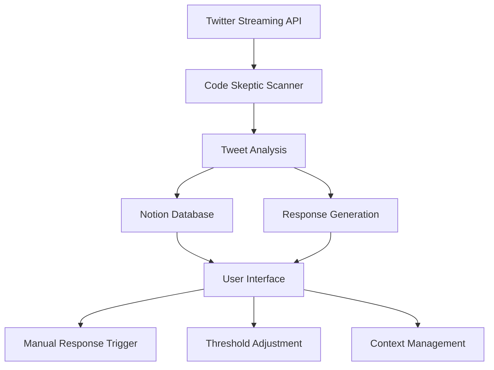
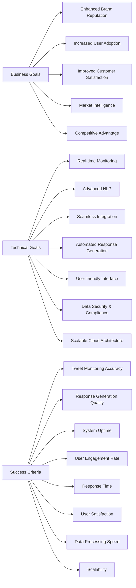
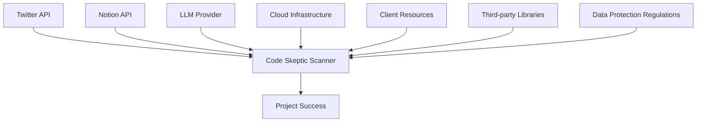
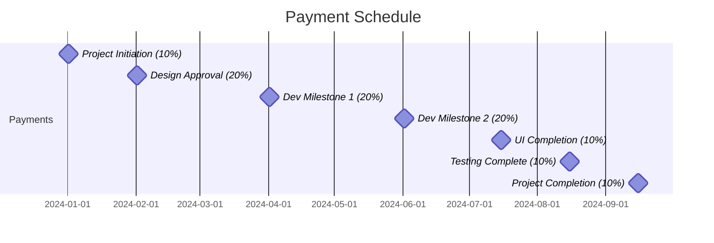
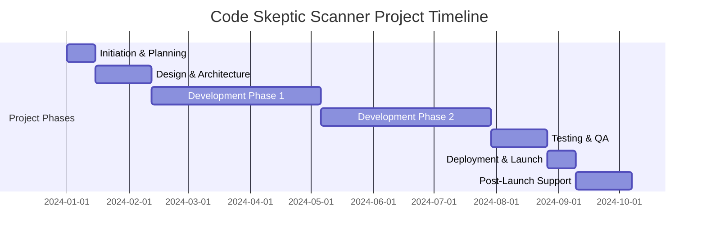
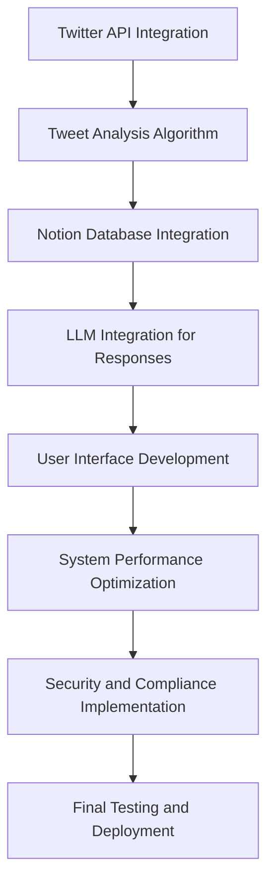
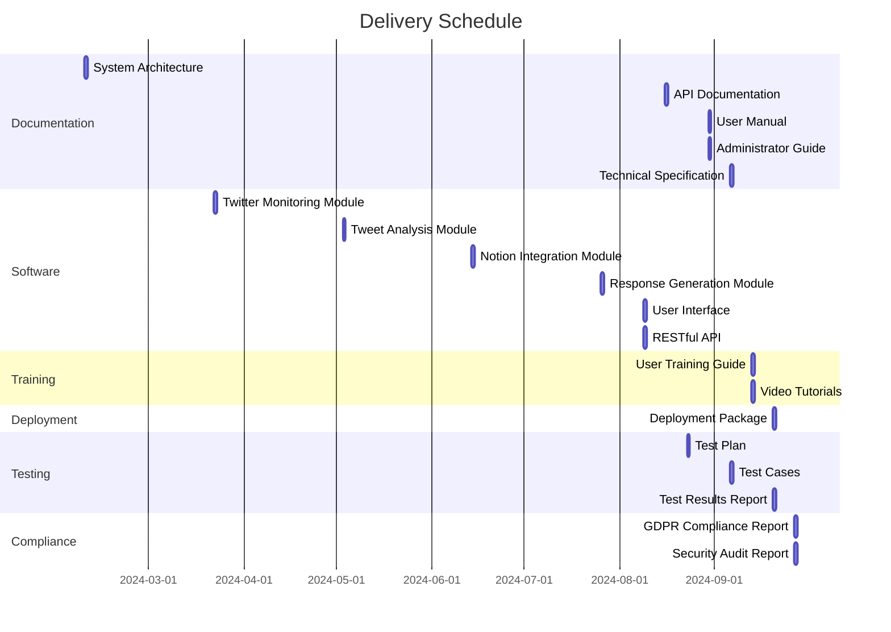

## EXECUTIVE SUMMARY

### PROJECT OVERVIEW

Code Skeptic Scanner is a cloud-based solution designed to monitor, analyze, and respond to skeptical or negative opinions about AI coding tools on Twitter/X in real-time. This innovative system addresses the growing need for companies in the AI development space to stay informed about public sentiment and engage proactively with their audience.

The solution will:
1. Monitor Twitter's Streaming API for relevant tweets
2. Analyze tweet content and popularity
3. Store extracted information in a Notion database
4. Generate AI-powered responses to skeptical tweets
5. Provide a user-friendly interface for managing the entire process

By implementing Code Skeptic Scanner, our client will gain valuable insights into public perception of AI coding tools and have the ability to respond promptly and effectively to concerns or criticisms.

### OBJECTIVES

1. Real-time monitoring: Continuously track Twitter for skeptical opinions about AI coding tools
2. Data collection and analysis: Extract and store relevant information in a structured Notion database
3. Automated response generation: Utilize LLM technology to create appropriate replies to identified tweets
4. User empowerment: Provide an intuitive UI for customizing monitoring parameters and managing responses
5. Compliance and scalability: Ensure GDPR compliance, respect Twitter's terms of service, and build a scalable solution

### VALUE PROPOSITION

Our agency offers unique advantages for implementing the Code Skeptic Scanner:

1. Expertise in AI and natural language processing: Our team's deep understanding of LLM technology ensures accurate tweet analysis and high-quality response generation
2. Integration proficiency: Seamless integration with Twitter API, Notion, and custom UI development
3. Scalable cloud architecture: Design and implementation of a robust, scalable solution capable of handling high volumes of data in real-time
4. User-centric design: Focus on creating an intuitive, efficient interface that empowers the client's team to manage the entire process effectively
5. Compliance-first approach: Ensuring GDPR compliance and adherence to platform terms of service from the ground up
6. Customization and flexibility: Ability to tailor the solution to the client's specific needs and adapt to changing requirements

By choosing our agency for this project, the client will benefit from a comprehensive, cutting-edge solution that not only meets their current needs but also provides a foundation for future growth and adaptation in the dynamic field of AI development and public perception management.

## PROJECT OBJECTIVES

### BUSINESS GOALS

1. Enhance Brand Reputation: Improve public perception of AI coding tools by actively engaging with skeptics and addressing concerns in real-time.

2. Increase User Adoption: Drive higher adoption rates of AI coding tools by effectively countering misconceptions and showcasing benefits.

3. Improve Customer Satisfaction: Provide timely and personalized responses to user concerns, leading to increased satisfaction and loyalty.

4. Market Intelligence: Gain valuable insights into user sentiment, concerns, and trends related to AI coding tools to inform product development and marketing strategies.

5. Competitive Advantage: Establish a proactive and responsive online presence that sets the company apart from competitors in the AI development space.

### TECHNICAL GOALS

1. Real-time Monitoring System: Develop a robust, scalable system capable of continuously monitoring Twitter's Streaming API for relevant tweets about AI coding tools.

2. Advanced Natural Language Processing: Implement sophisticated NLP algorithms to accurately analyze tweet content, sentiment, and relevance.

3. Seamless Integration: Create smooth integrations between Twitter API, Notion database, and custom UI components.

4. Automated Response Generation: Develop an AI-powered response module using LLM technology to generate contextually appropriate and engaging replies.

5. User-friendly Interface: Design and implement an intuitive, efficient UI that allows easy management of the entire process.

6. Data Security and Compliance: Ensure GDPR compliance and adherence to Twitter's terms of service in all aspects of data collection, storage, and processing.

7. Scalable Cloud Architecture: Develop a cloud-based solution capable of handling high volumes of data and requests in real-time.

### SUCCESS CRITERIA

| Criterion | Description | Target |
|-----------|-------------|--------|
| Tweet Monitoring Accuracy | Percentage of relevant tweets correctly identified | ≥ 95% |
| Response Generation Quality | Percentage of generated responses deemed appropriate and on-brand | ≥ 90% |
| System Uptime | Percentage of time the system is operational and accessible | ≥ 99.9% |
| User Engagement Rate | Percentage increase in positive interactions with AI coding tool tweets | ≥ 25% |
| Response Time | Average time between tweet identification and response generation | ≤ 5 minutes |
| User Satisfaction | Rating of UI usability and overall system effectiveness by client team | ≥ 4.5/5 |
| Data Processing Speed | Average time to process and store tweet data in Notion database | ≤ 30 seconds |
| Scalability | Maximum number of tweets processed per minute without performance degradation | ≥ 1000 |

## SCOPE OF WORK

### IN-SCOPE

1. Twitter Monitoring System
   - Develop a real-time monitoring system using Twitter's Streaming API
   - Implement filters to identify tweets expressing skepticism about AI coding tools
   - Create a scalable architecture to handle high volumes of incoming tweets

2. Tweet Analysis Module
   - Develop natural language processing algorithms to analyze tweet content
   - Implement a scoring system for the "Doubt Rating" (1-10 scale)
   - Create a mechanism to identify and tag specific AI tools mentioned in tweets

3. Notion Database Integration
   - Design and implement a Notion database structure to store tweet information
   - Develop an automated system to populate the database with extracted tweet data
   - Implement real-time Notion notifications for new tweet entries

4. Response Generation Module
   - Develop an LLM-based system for generating contextually appropriate responses
   - Implement a mechanism for incorporating custom prompts and context documents
   - Ensure generated responses align with @BlitzyAI's tone and messaging

5. User Interface Development
   - Create an intuitive web-based interface for managing the system
   - Implement features for adjusting popularity thresholds and managing context
   - Develop a dashboard for real-time monitoring and data visualization
   - Integrate direct links to original tweets for easy navigation and response

6. API Development
   - Design and implement a RESTful API for system management and data retrieval
   - Develop endpoints for manual response triggering and context management

7. Error Handling and Logging
   - Implement robust error handling mechanisms for API failures and rate limits
   - Develop a comprehensive logging system for troubleshooting and auditing

8. Compliance and Security
   - Ensure GDPR compliance in data collection, storage, and processing
   - Implement security measures to protect user data and system integrity

9. Scalability and Performance Optimization
   - Design and implement a cloud-based architecture for high availability
   - Optimize system performance to handle real-time processing of high tweet volumes

10. Analytics and Reporting
    - Develop basic analytics features to track trends in AI coding tool skepticism
    - Create customizable reports for insights into tweet patterns and sentiment

### OUT-OF-SCOPE

1. Advanced sentiment analysis beyond the specified "Doubt Rating" system
2. Integration with social media platforms other than Twitter/X
3. Automated posting of responses to Twitter (responses will be generated but not automatically posted)
4. Development of mobile applications (focus is on web-based interface)
5. Historical data analysis of tweets prior to system implementation
6. Advanced machine learning models for predicting future trends or user behavior
7. Integration with customer relationship management (CRM) systems
8. Multi-language support (initial focus on English-language tweets only)
9. Development of a public-facing API for third-party integrations
10. Custom branding or white-labeling of the user interface

### ASSUMPTIONS

1. Client will provide necessary Twitter API credentials and access tokens
2. Client has an active Notion account with appropriate permissions for database creation and management
3. Client will provide guidelines for tone and messaging aligned with the @BlitzyAI brand
4. Client team members have basic technical proficiency to use a web-based interface
5. Client will provide initial set of custom prompts and context documents for response generation
6. The project will use cloud infrastructure (e.g., AWS, Google Cloud, or Azure) for deployment
7. Client will handle any necessary legal reviews or approvals for data collection and storage
8. The system will operate within Twitter's API rate limits and terms of service
9. Client will provide timely feedback and approvals during the development process
10. The project will use English as the primary language for development and communication

### DEPENDENCIES

| Dependency | Description | Potential Impact |
|------------|-------------|------------------|
| Twitter API | Access to Twitter's Streaming API and compliance with their terms of service | Critical for core functionality; changes in API or terms could affect project timeline |
| Notion API | Integration with Notion for database management and notifications | Essential for data storage and team alerts; API changes could require adjustments |
| LLM Provider | Access to a suitable LLM for response generation (e.g., OpenAI GPT-4) | Critical for automated responses; service disruptions could affect response generation |
| Cloud Infrastructure | Availability and reliability of chosen cloud platform | Essential for system deployment; outages could impact overall system availability |
| Client Resources | Timely provision of necessary information, feedback, and approvals | Delays could impact project timeline and deliverables |
| Third-party Libraries | Availability and compatibility of required software libraries | Updates or deprecations could necessitate code adjustments |
| Data Protection Regulations | Compliance with GDPR and other applicable data protection laws | Changes in regulations could require system modifications |

This diagram illustrates the key dependencies and their relationship to the overall project success. Each dependency plays a crucial role in the development and operation of the Code Skeptic Scanner, and any issues with these dependencies could potentially impact the project timeline or deliverables.

## BUDGET AND COST ESTIMATES

### COST BREAKDOWN

The following table provides a detailed breakdown of the project costs for the Code Skeptic Scanner:

| Category | Item | Quantity | Unit Cost | Total Cost |
|----------|------|----------|-----------|------------|
| Labor | Senior Software Engineer | 800 hours | $150/hour | $120,000 |
| Labor | UI/UX Designer | 200 hours | $120/hour | $24,000 |
| Labor | Data Scientist | 160 hours | $140/hour | $22,400 |
| Labor | Project Manager | 240 hours | $130/hour | $31,200 |
| Labor | Quality Assurance Specialist | 160 hours | $100/hour | $16,000 |
| Infrastructure | Cloud Services (AWS) | 12 months | $2,000/month | $24,000 |
| Software | LLM API Usage | 1,000,000 tokens | $0.02/1000 tokens | $20,000 |
| Software | Twitter API (Enterprise) | 12 months | $1,500/month | $18,000 |
| Software | Notion API | 12 months | $20/month | $240 |
| Miscellaneous | Development Tools and Licenses | Various | - | $5,000 |
| Contingency | 10% of total budget | - | - | $28,084 |
| **Total** | | | | **$308,924** |

### PAYMENT SCHEDULE

We propose the following payment schedule tied to project milestones:

1. Project Initiation (10%): $30,892.40
   - Due upon contract signing

2. Design and Architecture Approval (20%): $61,784.80
   - Due upon client approval of system design and architecture

3. Development Milestone 1 (20%): $61,784.80
   - Due upon completion of Twitter monitoring and analysis modules

4. Development Milestone 2 (20%): $61,784.80
   - Due upon completion of Notion integration and response generation modules

5. User Interface Completion (10%): $30,892.40
   - Due upon completion of the user interface and API

6. Testing and Quality Assurance (10%): $30,892.40
   - Due upon successful completion of system testing

7. Project Completion and Deployment (10%): $30,892.40
   - Due upon successful deployment and client acceptance

### BUDGET CONSIDERATIONS

1. API Usage Fluctuations: The costs associated with Twitter API and LLM API usage are estimates based on projected usage. Actual costs may vary depending on the volume of tweets processed and the number of responses generated. We will implement usage monitoring and alerts to manage this risk.

2. Cloud Infrastructure Scaling: As the system scales, there may be a need for additional cloud resources. We have included a buffer in the cloud services budget, but significant increases in data volume could necessitate additional spending.

3. Regulatory Compliance: Changes in data protection regulations or Twitter's terms of service may require additional development work to ensure compliance. The contingency budget is partly allocated to address such potential changes.

4. Extended Development Time: If the project timeline extends beyond the estimated duration, additional labor costs may be incurred. We will mitigate this risk through careful project management and regular progress reviews.

5. Third-Party Integration Challenges: Unforeseen difficulties in integrating with Twitter or Notion APIs could lead to additional development time. We have factored in some buffer time, but significant issues could impact the budget.

6. Currency Fluctuations: For any services priced in foreign currencies (e.g., some cloud services), exchange rate fluctuations could affect the final cost in USD. We will monitor this and adjust as necessary.

7. Scope Changes: Any significant changes to the project scope requested by the client may impact the budget. We will manage this through a formal change request process, with associated cost estimates provided for approval before implementation.

To manage these budget considerations:

- We will provide monthly budget reports to track spending against projections.
- The project manager will conduct regular risk assessments to identify and mitigate potential budget impacts.
- We have included a 10% contingency fund to address unforeseen expenses or minor scope adjustments.
- Any potential budget overruns will be communicated to the client promptly, along with proposed solutions or adjustments.

By maintaining transparent communication and proactive management of these budget considerations, we aim to deliver the Code Skeptic Scanner within the proposed budget while maintaining flexibility to address challenges as they arise.

## TIMELINE AND MILESTONES

### PROJECT TIMELINE

The Code Skeptic Scanner project will be executed over a 9-month period, divided into the following major phases:

1. Project Initiation and Planning: 2 weeks
2. Design and Architecture: 4 weeks
3. Development Phase 1 (Core Functionality): 12 weeks
4. Development Phase 2 (Integration and UI): 12 weeks
5. Testing and Quality Assurance: 4 weeks
6. Deployment and Launch: 2 weeks
7. Post-Launch Support and Optimization: 4 weeks

### KEY MILESTONES

| Milestone | Description | Target Date |
|-----------|-------------|-------------|
| M1 | Project Kickoff | Week 1 |
| M2 | Design and Architecture Approval | Week 6 |
| M3 | Twitter Monitoring Module Complete | Week 12 |
| M4 | Tweet Analysis Module Complete | Week 18 |
| M5 | Notion Integration Complete | Week 24 |
| M6 | Response Generation Module Complete | Week 30 |
| M7 | User Interface and API Complete | Week 32 |
| M8 | System Testing Complete | Week 36 |
| M9 | System Deployment and Go-Live | Week 38 |
| M10 | Post-Launch Review and Optimization Complete | Week 42 |

### CRITICAL PATH

The following tasks and activities are critical to keeping the project on schedule:

1. Twitter API Integration: Establishing a stable connection and data flow from Twitter's Streaming API is crucial for all subsequent development.

2. Tweet Analysis Algorithm Development: The accuracy and efficiency of the tweet analysis module are fundamental to the system's core functionality.

3. Notion Database Design and Integration: A well-structured database and seamless integration with Notion are essential for data storage and team notifications.

4. LLM Integration for Response Generation: Implementing and fine-tuning the LLM-based response generation module is critical for the system's value proposition.

5. User Interface Development: An intuitive and efficient UI is crucial for user adoption and effective system management.

6. System Performance Optimization: Ensuring the system can handle high volumes of real-time data processing is vital for its reliability and scalability.

7. Security and Compliance Implementation: GDPR compliance and adherence to Twitter's terms of service must be ensured throughout the development process.

To maintain the project schedule:

1. Early focus on API integrations and core algorithms to identify and address potential challenges quickly.
2. Regular progress reviews and risk assessments to proactively manage potential delays.
3. Parallel development of non-dependent modules where possible to optimize the timeline.
4. Continuous communication with the client to ensure timely feedback and approvals at each milestone.
5. Flexibility in resource allocation to address bottlenecks in critical path activities.

By closely monitoring these critical path elements and maintaining flexibility in our approach, we aim to deliver the Code Skeptic Scanner on schedule while meeting all project objectives and quality standards.

## DELIVERABLES

### LIST OF DELIVERABLES

1. Software Components
   - Twitter Monitoring Module
   - Tweet Analysis Module
   - Notion Database Integration Module
   - Response Generation Module
   - User Interface (Web Application)
   - RESTful API

2. Documentation
   - System Architecture Document
   - API Documentation
   - User Manual
   - Administrator Guide
   - Technical Specification Document

3. Training Materials
   - User Training Guide
   - Video Tutorials for Key Features

4. Deployment Package
   - Deployment Scripts
   - Configuration Files
   - Environment Setup Guide

5. Testing Artifacts
   - Test Plan
   - Test Cases
   - Test Results Report

6. Security and Compliance Documents
   - GDPR Compliance Report
   - Security Audit Report

### DELIVERY SCHEDULE

| Deliverable | Expected Delivery Date |
|-------------|------------------------|
| System Architecture Document | Week 6 |
| Twitter Monitoring Module | Week 12 |
| Tweet Analysis Module | Week 18 |
| Notion Database Integration Module | Week 24 |
| Response Generation Module | Week 30 |
| User Interface (Web Application) | Week 32 |
| RESTful API | Week 32 |
| API Documentation | Week 33 |
| Test Plan | Week 34 |
| User Manual | Week 35 |
| Administrator Guide | Week 35 |
| Technical Specification Document | Week 36 |
| Test Cases | Week 36 |
| User Training Guide | Week 37 |
| Video Tutorials | Week 37 |
| Deployment Scripts | Week 38 |
| Configuration Files | Week 38 |
| Environment Setup Guide | Week 38 |
| Test Results Report | Week 38 |
| GDPR Compliance Report | Week 39 |
| Security Audit Report | Week 39 |

### ACCEPTANCE CRITERIA

1. Software Components
   - Successfully pass all unit and integration tests
   - Meet performance benchmarks (e.g., response time, throughput)
   - Comply with specified coding standards and best practices
   - Demonstrate all required functionalities as per the project specifications

2. Twitter Monitoring Module
   - Accurately capture 99% of relevant tweets based on specified criteria
   - Handle Twitter API rate limits without service interruption
   - Process a minimum of 1000 tweets per minute

3. Tweet Analysis Module
   - Achieve 95% accuracy in sentiment analysis and doubt rating
   - Correctly identify and tag mentioned AI tools with 98% accuracy
   - Process tweets within 5 seconds of receipt

4. Notion Database Integration Module
   - Successfully store all required tweet information in the Notion database
   - Trigger real-time notifications for new entries
   - Maintain data consistency between the system and Notion

5. Response Generation Module
   - Generate contextually relevant responses for 90% of tweets
   - Produce responses that align with @BlitzyAI's tone and messaging guidelines
   - Generate responses within 10 seconds of tweet analysis

6. User Interface
   - Meet all specified functional requirements
   - Achieve a System Usability Scale (SUS) score of 80 or higher
   - Be compatible with the latest versions of Chrome, Firefox, and Safari browsers
   - Responsive design that works on desktop and tablet devices

7. RESTful API
   - Meet all specified endpoint requirements
   - Achieve 99.9% uptime during load testing
   - Response time under 200ms for 95% of requests under normal load

8. Documentation
   - Comprehensive coverage of all system components and features
   - Clear, concise, and free of technical errors
   - Includes all required sections as specified in the project requirements

9. Training Materials
   - Cover all key features and workflows of the system
   - Receive a satisfaction rating of 4 out of 5 or higher from test users

10. Deployment Package
    - Successfully deploy the system in a test environment within 4 hours
    - Include all necessary components for a complete system setup

11. Testing Artifacts
    - Test plan covers all critical functionalities and edge cases
    - All test cases are clearly documented and reproducible
    - Test results report provides clear pass/fail status for all test cases

12. Security and Compliance Documents
    - GDPR compliance report addresses all relevant regulations
    - Security audit report identifies no critical vulnerabilities

Each deliverable will be subject to a formal review process by the client. Acceptance will be granted when all specified criteria are met, and any identified issues are resolved to the client's satisfaction. The client will have a 10-business-day review period for each deliverable, during which they can request revisions or clarifications before final acceptance.