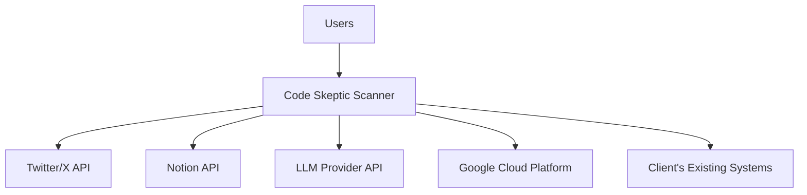
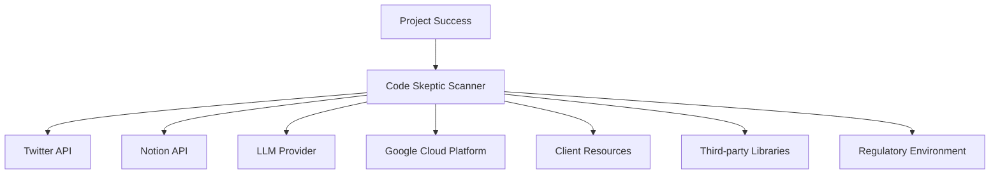
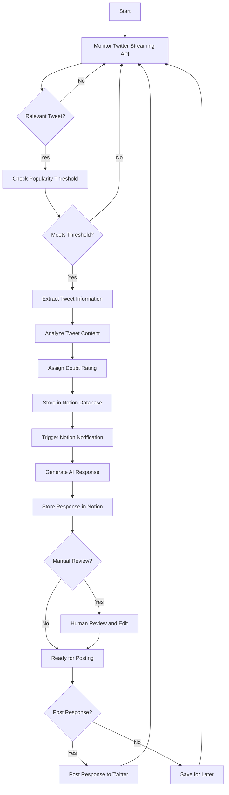
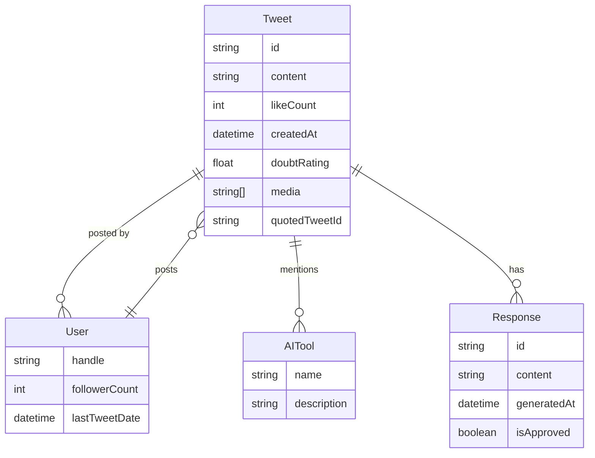
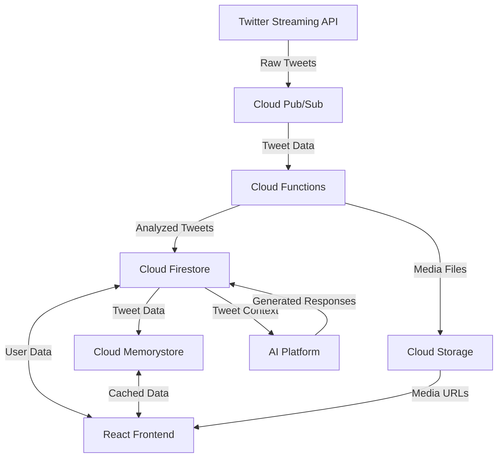
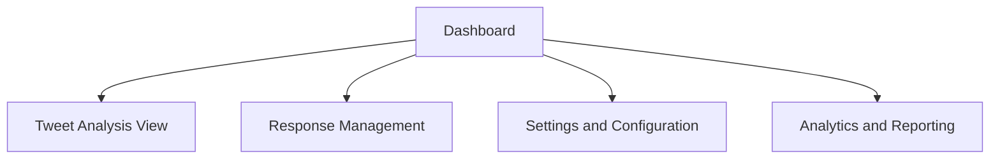
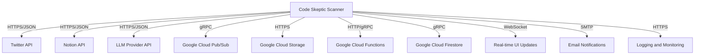

## INTRODUCTION

### PURPOSE

The purpose of this Software Requirements Specification (SRS) document is to provide a comprehensive and detailed description of the Code Skeptic Scanner system. This document serves as the primary reference for the development team, project stakeholders, and quality assurance personnel involved in the creation and implementation of the system.

The intended audience for this SRS includes:

1. Development Team: Software engineers, data scientists, and UI/UX designers responsible for implementing the system.
2. Project Managers: To guide project planning, resource allocation, and timeline management.
3. Quality Assurance Team: For developing test plans and ensuring the system meets specified requirements.
4. Client Stakeholders: To review and approve the proposed system features and functionalities.
5. Maintenance and Support Teams: For future reference in system updates and troubleshooting.

This document aims to:
- Clearly define the functional and non-functional requirements of the Code Skeptic Scanner.
- Establish a common understanding of the system's capabilities and constraints among all stakeholders.
- Serve as a basis for estimating costs, risks, and schedules.
- Provide a foundation for contract agreements between the development team and the client.

### SCOPE

The Code Skeptic Scanner is a cloud-based solution designed to monitor, analyze, and respond to skeptical or negative opinions about AI coding tools on Twitter/X in real-time. This innovative system addresses the growing need for companies in the AI development space to stay informed about public sentiment and engage proactively with their audience.

High-level overview of the software product:

1. Core Functionalities:
   - Real-time monitoring of Twitter's Streaming API for relevant tweets
   - Advanced natural language processing for tweet analysis and sentiment scoring
   - Automated storage of tweet information in a Notion database
   - AI-powered response generation using LLM technology
   - User-friendly web interface for system management and data visualization

2. Technology Stack:
   - Frontend: React with TypeScript and Tailwind CSS for a responsive and modern UI
   - Backend: Python for robust data processing and API development
   - Cloud Infrastructure: Google Cloud Platform for scalable and reliable hosting
   - Database: Notion API for flexible and collaborative data storage
   - AI/ML: Integration with advanced LLM models for response generation

3. Goals:
   - Enhance brand reputation by actively engaging with skeptics of AI coding tools
   - Provide real-time insights into public sentiment and concerns
   - Streamline the process of monitoring and responding to relevant social media content
   - Enable data-driven decision-making for product development and marketing strategies

4. Benefits:
   - Improved public perception of AI coding tools through timely and relevant engagement
   - Increased user adoption rates by effectively addressing misconceptions
   - Enhanced customer satisfaction through prompt and personalized responses
   - Valuable market intelligence on user sentiment and trends
   - Competitive advantage through proactive and responsive online presence

5. Key Features:
   - Customizable popularity thresholds for tweet monitoring
   - Automated Notion database population and real-time notifications
   - Intuitive dashboard for tweet analysis and response management
   - Flexible API for system integration and customization
   - Robust error handling and logging for system reliability
   - GDPR-compliant data handling and storage

By implementing the Code Skeptic Scanner, organizations can effectively monitor, analyze, and engage with the public discourse surrounding AI coding tools, fostering a more positive and informed dialogue in the rapidly evolving field of AI development.

## PRODUCT DESCRIPTION

### PRODUCT PERSPECTIVE

The Code Skeptic Scanner is a standalone cloud-based solution designed to integrate with existing social media monitoring and customer engagement workflows. It operates within the broader ecosystem of AI development tools and social media management platforms. The system interacts with the following external systems and environments:

1. Twitter/X Platform: Utilizes Twitter's Streaming API to monitor and collect real-time data on tweets related to AI coding tools.

2. Notion: Integrates with Notion's API for structured data storage and team collaboration.

3. Large Language Model (LLM) Provider: Leverages advanced LLM technology (e.g., OpenAI's GPT-4) for generating contextually appropriate responses.

4. Google Cloud Platform: Hosts the application and provides scalable infrastructure for data processing and storage.

5. Client's Existing Systems: May integrate with the client's customer relationship management (CRM) or marketing automation tools for a seamless workflow.

### PRODUCT FUNCTIONS

The Code Skeptic Scanner performs the following main functions:

1. Real-time Tweet Monitoring: Continuously monitors Twitter's Streaming API to identify tweets expressing skepticism or negative opinions about AI coding tools.

2. Tweet Analysis and Scoring: Analyzes tweet content using natural language processing to determine relevance, sentiment, and assign a "Doubt Rating" on a scale of 1-10.

3. Data Extraction and Storage: Extracts relevant information from tweets (e.g., account handle, follower count, tweet content) and stores it in a structured Notion database.

4. Automated Response Generation: Utilizes LLM technology to generate contextually appropriate responses to identified tweets, aligning with the @BlitzyAI brand voice.

5. Notification System: Triggers real-time notifications in Notion when new tweets are added to the database, alerting team members.

6. User Interface for System Management: Provides a web-based interface for users to adjust monitoring parameters, manage context, and oversee the entire process.

7. Manual Response Triggering: Allows users to manually trigger response generation for specific tweets through the UI.

8. Analytics and Reporting: Offers basic analytics features to track trends in AI coding tool skepticism over time.

9. API Access: Provides a RESTful API for system integration and customization.

### USER CHARACTERISTICS

The Code Skeptic Scanner is designed for use by the following user personas:

1. Social Media Manager
   - Expertise: High proficiency in social media platforms and engagement strategies
   - Responsibilities: Monitoring tweet activity, reviewing generated responses, and managing overall engagement strategy
   - Technical Skills: Comfortable with web-based tools and basic data analysis

2. AI Product Marketing Specialist
   - Expertise: Deep understanding of AI coding tools and market trends
   - Responsibilities: Analyzing sentiment trends, refining response strategies, and providing context for the response generation system
   - Technical Skills: Familiarity with data visualization and basic API concepts

3. Customer Support Representative
   - Expertise: Strong communication skills and knowledge of AI coding tools
   - Responsibilities: Reviewing and customizing generated responses, directly engaging with users when necessary
   - Technical Skills: Proficient in using web-based customer engagement tools

4. Data Analyst
   - Expertise: Advanced skills in data analysis and visualization
   - Responsibilities: Analyzing trends, generating reports, and providing insights to inform strategy
   - Technical Skills: Proficient in data manipulation, statistical analysis, and using APIs

5. System Administrator
   - Expertise: Strong technical background in cloud infrastructure and system integration
   - Responsibilities: Managing system configuration, monitoring performance, and ensuring security compliance
   - Technical Skills: Advanced knowledge of Google Cloud Platform, API integration, and system architecture

### CONSTRAINTS

1. Twitter API Limitations: The system must operate within Twitter's API rate limits and comply with their terms of service.

2. Data Privacy Regulations: All data collection, storage, and processing must comply with GDPR and other applicable data protection laws.

3. Response Time: The system must generate and store responses within 30 seconds of tweet identification to ensure timely engagement.

4. Scalability: The solution must handle a minimum of 1000 tweets per minute without performance degradation.

5. Browser Compatibility: The web interface must be compatible with the latest versions of Chrome, Firefox, and Safari browsers.

6. Mobile Responsiveness: While not optimized for mobile devices, the UI must be usable on tablets.

7. Language Support: Initial development will focus on English-language tweets only.

8. Budget Constraints: Development and operational costs must remain within the approved budget of $308,924.

9. Timeline: The project must be completed within the 9-month timeline as outlined in the project schedule.

10. Integration Limitations: The system will not directly post responses to Twitter; it will only generate and store them for manual review and posting.

### ASSUMPTIONS AND DEPENDENCIES

Assumptions:

1. The client will provide necessary Twitter API credentials and maintain an active enterprise-level account.

2. The client has an active Notion workspace with appropriate permissions for database creation and management.

3. The selected LLM provider (e.g., OpenAI) will maintain service availability and API compatibility throughout the project lifecycle.

4. The client's team has basic technical proficiency to use a web-based interface and interpret data visualizations.

5. The volume of relevant tweets will remain within the estimated range used for system design and cost projections.

6. English will remain the primary language for both development and the tweets being monitored.

Dependencies:

1. Twitter API: The project relies on the continued availability and current functionality of Twitter's Streaming API.

2. Notion API: Successful integration and ongoing compatibility with Notion's API are crucial for data storage and team collaboration features.

3. LLM Provider: The quality and availability of the chosen LLM service (e.g., GPT-4) directly impact the response generation capability.

4. Google Cloud Platform: The project depends on the reliability and scalability of Google Cloud services for hosting and data processing.

5. Client Resources: Timely provision of necessary information, feedback, and approvals from the client team is essential for meeting project milestones.

6. Third-party Libraries: The project relies on various open-source libraries for development, particularly in the React and Python ecosystems.

7. Regulatory Environment: Any changes to data protection laws or social media regulations may require system modifications.

This diagram illustrates the key dependencies of the Code Skeptic Scanner project, highlighting the critical role each external factor plays in the overall success of the system.

## PROCESS FLOWCHART

The following flowchart illustrates the high-level process flow of the Code Skeptic Scanner system:

This flowchart outlines the main processes of the Code Skeptic Scanner:

1. The system continuously monitors the Twitter Streaming API for tweets.
2. When a relevant tweet is identified, it checks if it meets the popularity threshold.
3. If the tweet meets the threshold, the system extracts and analyzes the tweet information.
4. The tweet is assigned a Doubt Rating and stored in the Notion database.
5. A Notion notification is triggered to alert the team.
6. An AI-generated response is created using the LLM-based response module.
7. The generated response is stored in the Notion database.
8. Optionally, the response can undergo manual review and editing.
9. The response is then either posted to Twitter or saved for later use.
10. The process continues in a loop, returning to monitoring for new tweets.

This process ensures that all relevant tweets are captured, analyzed, and responded to in a timely and efficient manner, while allowing for human oversight and intervention when necessary. The system's modular design, implemented using Python for the backend processes and React with TypeScript and Tailwind CSS for the user interface, allows for easy scaling and modification of individual components as needed.

Here's a breakdown of the Code Skeptic Scanner product into features, using the specified technologies and following the requested format:

### Feature 1: Real-time Tweet Monitoring

ID: F001
DESCRIPTION: Continuously monitor Twitter's Streaming API to identify tweets expressing skepticism or negative opinions about AI coding tools.
PRIORITY: High

| ID | Requirement | Description |
|----|-------------|-------------|
| F001-1 | Twitter API Integration | Establish and maintain a connection to Twitter's Streaming API using Python |
| F001-2 | Tweet Filtering | Implement filters to identify relevant tweets based on keywords, hashtags, and user mentions |
| F001-3 | Rate Limit Handling | Develop a mechanism to handle Twitter API rate limits and ensure continuous monitoring |
| F001-4 | Scalability | Design the monitoring system to handle high volumes of incoming tweets using Google Cloud Pub/Sub |

### Feature 2: Tweet Analysis and Scoring

ID: F002
DESCRIPTION: Analyze tweet content using natural language processing to determine relevance, sentiment, and assign a "Doubt Rating" on a scale of 1-10.
PRIORITY: High

| ID | Requirement | Description |
|----|-------------|-------------|
| F002-1 | Sentiment Analysis | Implement NLP algorithms in Python to analyze tweet sentiment |
| F002-2 | Doubt Rating Calculation | Develop a scoring system to assign a "Doubt Rating" based on tweet content |
| F002-3 | AI Tool Identification | Create a mechanism to identify and tag specific AI tools mentioned in tweets |
| F002-4 | Performance Optimization | Optimize the analysis process to handle high volumes of tweets in real-time |

### Feature 3: Notion Database Integration

ID: F003
DESCRIPTION: Extract relevant information from tweets and store it in a structured Notion database, with real-time notifications for new entries.
PRIORITY: High

| ID | Requirement | Description |
|----|-------------|-------------|
| F003-1 | Notion API Integration | Develop a Python module to interact with the Notion API for database operations |
| F003-2 | Data Extraction | Extract required information from tweets (e.g., handle, followers, likes, content) |
| F003-3 | Automated Data Storage | Implement a system to automatically populate the Notion database with extracted tweet data |
| F003-4 | Real-time Notifications | Develop a mechanism to trigger Notion notifications for new tweet entries |

### Feature 4: AI-powered Response Generation

ID: F004
DESCRIPTION: Utilize LLM technology to generate contextually appropriate responses to identified tweets, aligning with the @BlitzyAI brand voice.
PRIORITY: High

| ID | Requirement | Description |
|----|-------------|-------------|
| F004-1 | LLM Integration | Integrate with a suitable LLM provider (e.g., OpenAI's GPT-4) using Python |
| F004-2 | Context Management | Develop a system to manage and incorporate custom prompts and context documents |
| F004-3 | Response Generation | Create an algorithm to generate responses based on tweet content and context |
| F004-4 | Brand Voice Alignment | Implement checks to ensure generated responses align with @BlitzyAI's tone and messaging |

### Feature 5: User Interface for System Management

ID: F005
DESCRIPTION: Develop a web-based interface for users to adjust monitoring parameters, manage context, and oversee the entire process.
PRIORITY: Medium

| ID | Requirement | Description |
|----|-------------|-------------|
| F005-1 | Dashboard Development | Create a React-based dashboard with Tailwind CSS for real-time monitoring and data visualization |
| F005-2 | Threshold Management | Implement UI components for adjusting tweet popularity thresholds |
| F005-3 | Context Management UI | Develop interfaces for adding, editing, or removing context for tweet analysis |
| F005-4 | Response Management | Create a UI for reviewing and managing generated responses |
| F005-5 | Notion Database Embedding | Integrate the Notion database directly into the UI for easy access to collected data |

### Feature 6: RESTful API

ID: F006
DESCRIPTION: Develop a RESTful API to allow programmatic access to system functions and data.
PRIORITY: Medium

| ID | Requirement | Description |
|----|-------------|-------------|
| F006-1 | API Development | Create a RESTful API using Python and Flask, deployed on Google Cloud Run |
| F006-2 | Authentication | Implement secure authentication mechanisms for API access |
| F006-3 | Endpoint Implementation | Develop endpoints for all required system functions (e.g., triggering responses, adjusting thresholds) |
| F006-4 | API Documentation | Generate comprehensive API documentation using tools like Swagger |

### Feature 7: Analytics and Reporting

ID: F007
DESCRIPTION: Implement basic analytics features to track trends in AI coding tool skepticism over time.
PRIORITY: Low

| ID | Requirement | Description |
|----|-------------|-------------|
| F007-1 | Data Aggregation | Develop algorithms to aggregate tweet data for trend analysis |
| F007-2 | Visualization Components | Create React components with charting libraries for data visualization |
| F007-3 | Custom Report Generation | Implement functionality to generate custom reports based on user-defined parameters |
| F007-4 | Export Capabilities | Develop features to export analytics data in various formats (e.g., CSV, PDF) |

### Feature 8: Error Handling and Logging

ID: F008
DESCRIPTION: Implement robust error handling and logging to manage rate limits, API failures, and other potential issues.
PRIORITY: Medium

| ID | Requirement | Description |
|----|-------------|-------------|
| F008-1 | Centralized Logging | Implement a centralized logging system using Google Cloud Logging |
| F008-2 | Error Detection | Develop mechanisms to detect and categorize various types of errors and issues |
| F008-3 | Automated Alerts | Create an alerting system for critical errors using Google Cloud Monitoring |
| F008-4 | Error Recovery | Implement automated recovery procedures for common error scenarios |

### Feature 9: Security and Compliance

ID: F009
DESCRIPTION: Ensure GDPR compliance and respect Twitter's terms of service regarding data collection and storage.
PRIORITY: High

| ID | Requirement | Description |
|----|-------------|-------------|
| F009-1 | Data Encryption | Implement end-to-end encryption for data storage and transmission |
| F009-2 | Access Control | Develop role-based access control for system functions and data |
| F009-3 | GDPR Compliance | Implement features to ensure GDPR compliance (e.g., data deletion, export) |
| F009-4 | Audit Logging | Create a comprehensive audit logging system for all data access and modifications |

## NON-FUNCTIONAL REQUIREMENTS

### PERFORMANCE

1. Response Time
   - The system shall process and analyze incoming tweets within 5 seconds of receipt.
   - The user interface shall load and render within 2 seconds on desktop devices with a standard broadband connection.
   - API endpoints shall respond to requests within 200ms under normal load conditions.

2. Throughput
   - The Twitter monitoring module shall handle a minimum of 1000 tweets per minute.
   - The system shall support at least 100 concurrent users without performance degradation.
   - The Notion database integration shall support up to 10,000 write operations per hour.

3. Resource Usage
   - The backend Python services shall not consume more than 4GB of RAM per instance.
   - The React-based frontend shall not exceed 5MB in size (gzipped) to ensure fast loading times.
   - Database queries shall be optimized to execute within 100ms for 95% of operations.

### SAFETY

1. Data Backup
   - The system shall perform automated daily backups of all critical data stored in Google Cloud Storage.
   - Backups shall be retained for a minimum of 30 days.

2. Fault Tolerance
   - The system shall implement redundancy for critical components using Google Cloud's load balancing and auto-scaling features.
   - In case of a component failure, the system shall automatically switch to a backup instance within 30 seconds.

3. Error Handling
   - The system shall log all errors and exceptions in Google Cloud Logging for post-mortem analysis.
   - Critical errors shall trigger automated alerts to the development and operations teams via email and SMS.

4. Data Integrity
   - The system shall implement transaction management to ensure data consistency across all operations.
   - In case of a failed operation, the system shall roll back any partial changes to maintain data integrity.

### SECURITY

1. Authentication
   - The system shall use OAuth 2.0 for user authentication, integrated with Google Cloud Identity Platform.
   - Multi-factor authentication (MFA) shall be mandatory for all administrative accounts.

2. Authorization
   - The system shall implement role-based access control (RBAC) to manage user permissions.
   - API access shall be controlled using JWT tokens with a maximum lifespan of 1 hour.

3. Data Encryption
   - All data at rest shall be encrypted using AES-256 encryption in Google Cloud Storage.
   - All data in transit shall be encrypted using TLS 1.3 or higher.

4. Privacy
   - The system shall anonymize or pseudonymize personal data where possible.
   - The system shall provide functionality for users to request deletion of their personal data in compliance with GDPR.

5. Security Monitoring
   - The system shall use Google Cloud Security Command Center for continuous security monitoring and threat detection.
   - Security logs shall be retained for a minimum of 90 days for audit purposes.

### QUALITY

1. Availability
   - The system shall maintain 99.9% uptime, excluding scheduled maintenance windows.
   - Scheduled maintenance shall not exceed 4 hours per month and must be performed during off-peak hours.

2. Maintainability
   - The codebase shall adhere to PEP 8 style guide for Python code and Airbnb style guide for TypeScript/React code.
   - The system shall use Docker containers for consistent development and deployment environments.
   - All code changes shall be reviewed and approved by at least one other developer before merging.

3. Usability
   - The user interface shall achieve a System Usability Scale (SUS) score of 80 or higher.
   - The system shall support keyboard navigation for all major functions to ensure accessibility.
   - The user interface shall be responsive and functional on devices with screen sizes ranging from 768px to 1920px width.

4. Scalability
   - The system shall be designed to scale horizontally using Google Kubernetes Engine (GKE) to handle up to 10x the initial load without significant code changes.
   - Database sharding shall be implemented to support future growth beyond 1 million tweets per day.

5. Reliability
   - The system shall have a Mean Time Between Failures (MTBF) of at least 720 hours (30 days).
   - The system shall have a Mean Time To Recover (MTTR) of less than 1 hour for non-critical failures.

### COMPLIANCE

1. GDPR Compliance
   - The system shall provide mechanisms for users to exercise their rights under GDPR, including the right to access, rectify, and erase their personal data.
   - Data processing activities shall be logged and made available for audit purposes.

2. Twitter API Compliance
   - The system shall adhere to Twitter's Developer Agreement and Policy, including rate limits and data usage restrictions.
   - The system shall implement proper error handling and backoff mechanisms to respect Twitter's API rate limits.

3. Accessibility Standards
   - The user interface shall conform to WCAG 2.1 Level AA standards to ensure accessibility for users with disabilities.

4. Data Retention
   - The system shall implement data retention policies in compliance with relevant regulations, retaining tweet data for no longer than necessary for the stated purpose.

5. Audit Trail
   - The system shall maintain an immutable audit trail of all significant actions, including data access, modifications, and deletions.
   - Audit logs shall be retained for a minimum of 1 year and shall be tamper-proof.

6. Licensing Compliance
   - The system shall use only properly licensed third-party libraries and components.
   - A software bill of materials (SBOM) shall be maintained and updated with each release to track all dependencies and their licenses.

These non-functional requirements ensure that the Code Skeptic Scanner meets high standards of performance, safety, security, quality, and compliance. By adhering to these requirements, the system will provide a robust, scalable, and reliable solution for monitoring and responding to skeptical opinions about AI coding tools on Twitter.

## DATA REQUIREMENTS

### DATA MODELS

The Code Skeptic Scanner system will utilize the following data models:

1. Tweet
2. User
3. AITool
4. Response

These data models will be implemented using TypeScript interfaces for the frontend and Python classes for the backend. The models will be used to structure the data within the application and for communication between the frontend and backend.

### DATA STORAGE

The Code Skeptic Scanner will utilize a combination of Google Cloud Platform (GCP) services for data storage, ensuring scalability, reliability, and compliance with data protection regulations.

1. Primary Data Storage:
   - Google Cloud Firestore: A fully managed, serverless NoSQL document database will be used to store Tweet, User, AITool, and Response data.
   - Firestore provides automatic scaling, real-time updates, and strong consistency, which aligns well with the real-time nature of the application.

2. Media Storage:
   - Google Cloud Storage: Tweet media files (images, videos) will be stored in Cloud Storage buckets, with references stored in the Firestore documents.

3. Caching:
   - Google Cloud Memorystore: Redis-compatible in-memory data store will be used for caching frequently accessed data to improve performance.

4. Data Retention:
   - Tweet data will be retained for 90 days by default.
   - User data will be retained for the duration of the account's existence.
   - AITool data will be retained indefinitely.
   - Response data will be retained for 180 days.

5. Redundancy and Backup:
   - Firestore and Cloud Storage provide built-in redundancy across multiple regions.
   - Daily backups of Firestore data will be configured using Google Cloud Backup and DR service.
   - Cloud Storage buckets will be configured with versioning enabled to allow for easy recovery of previous versions.

6. Data Recovery:
   - Automated recovery processes will be implemented using Google Cloud Functions to restore data from backups in case of data loss or corruption.
   - A disaster recovery plan will be documented, detailing the steps to recover data and services in various failure scenarios.

7. Scalability:
   - Firestore and Cloud Storage automatically scale to handle increased data volume and read/write operations.
   - Monitoring and alerting will be set up using Google Cloud Monitoring to track usage patterns and trigger scaling actions when necessary.

### DATA PROCESSING

The Code Skeptic Scanner will process data through various stages, ensuring security and efficiency throughout the pipeline.

1. Data Collection:
   - Twitter Streaming API data will be ingested using Google Cloud Pub/Sub for real-time processing.

2. Data Analysis:
   - Google Cloud Functions will be used to process incoming tweets, perform sentiment analysis, and calculate doubt ratings.
   - Google Cloud Natural Language API will be utilized for advanced text analysis.

3. Response Generation:
   - Google Cloud AI Platform will be used to host and serve the LLM model for generating responses.

4. Data Flow:

5. Data Security:

   a. Encryption:
      - All data at rest will be encrypted using Google-managed encryption keys in Cloud Firestore and Cloud Storage.
      - Data in transit will be encrypted using TLS 1.2 or higher.

   b. Access Control:
      - Google Cloud Identity and Access Management (IAM) will be used to manage access to all GCP resources.
      - Principle of least privilege will be applied to all service accounts and user roles.

   c. Data Masking:
      - Sensitive user information will be masked in logs and non-production environments.

   d. Audit Logging:
      - Google Cloud Audit Logs will be enabled to track all data access and modifications.

   e. Secure API Communication:
      - All API endpoints will be secured using OAuth 2.0 and JWT tokens.
      - API Gateway will be used to manage and secure external API access.

   f. Data Isolation:
      - Virtual Private Cloud (VPC) will be used to isolate the application's network resources.
      - Cloud NAT will be implemented to control egress traffic.

   g. Compliance:
      - Regular security audits will be conducted to ensure compliance with GDPR and other relevant regulations.
      - Data Processing Agreement (DPA) will be in place with Google Cloud to ensure GDPR compliance.

6. Data Validation:
   - Input validation will be implemented at both frontend and backend levels to ensure data integrity.
   - Schema validation will be enforced in Firestore to maintain data consistency.

7. Error Handling:
   - Comprehensive error handling and logging will be implemented using Google Cloud Error Reporting and Logging.
   - Automated alerts will be set up for critical errors using Google Cloud Monitoring.

By implementing these data processing and security measures, the Code Skeptic Scanner will ensure efficient, secure, and compliant handling of all data throughout the system.

## EXTERNAL INTERFACES

### USER INTERFACES

The Code Skeptic Scanner will provide a web-based user interface developed using React with TypeScript and styled using Tailwind CSS. The interface will be responsive and optimized for desktop and tablet devices. The following key interfaces will be implemented:

1. Dashboard
   - Real-time display of incoming tweets and their analysis
   - Overview of system performance metrics
   - Quick access to key functions

2. Tweet Analysis View
   - Detailed view of individual tweets with analysis results
   - Options for manual review and response generation

3. Response Management Interface
   - List of generated responses with approval/edit options
   - Interface for manually triggering response generation

4. Settings and Configuration Panel
   - Controls for adjusting popularity thresholds
   - Management of custom prompts and context documents
   - System parameter configuration

5. Analytics and Reporting Interface
   - Visualizations of tweet trends and sentiment analysis
   - Customizable report generation tools

Placeholder for UI mockups:
[Dashboard Mockup]
[Tweet Analysis View Mockup]
[Response Management Interface Mockup]
[Settings and Configuration Panel Mockup]
[Analytics and Reporting Interface Mockup]

### SOFTWARE INTERFACES

The Code Skeptic Scanner will interact with several external software systems:

1. Twitter API
   - Interface: REST API
   - Purpose: Real-time tweet monitoring and data retrieval
   - Protocol: HTTPS
   - Data Format: JSON
   - Authentication: OAuth 2.0

2. Notion API
   - Interface: REST API
   - Purpose: Database storage and team notifications
   - Protocol: HTTPS
   - Data Format: JSON
   - Authentication: Bearer token

3. LLM Provider API (e.g., OpenAI GPT-4)
   - Interface: REST API
   - Purpose: Generation of contextual responses
   - Protocol: HTTPS
   - Data Format: JSON
   - Authentication: API key

4. Google Cloud Services
   - Pub/Sub
     - Purpose: Message queuing for tweet processing
     - Protocol: gRPC
   - Cloud Storage
     - Purpose: Storage of media files and backups
     - Protocol: HTTPS
   - Cloud Functions
     - Purpose: Serverless compute for specific tasks
     - Trigger: HTTP, Pub/Sub, Cloud Storage events

5. Database Interface
   - Type: Google Cloud Firestore
   - Purpose: Primary data storage for tweet information and system data
   - Protocol: gRPC
   - Data Format: Document-based NoSQL

### COMMUNICATION INTERFACES

1. Internal System Communication
   - Protocol: gRPC for high-performance internal service communication
   - Data Format: Protocol Buffers

2. External API Communication
   - Protocol: HTTPS
   - Data Format: JSON
   - Authentication: OAuth 2.0 for Twitter, Bearer tokens for other APIs

3. Real-time Updates
   - WebSocket protocol for pushing real-time updates to the user interface

4. Email Notifications
   - SMTP protocol for sending email alerts and reports
   - Integration with Google Cloud's email service

5. Logging and Monitoring
   - Integration with Google Cloud Logging and Monitoring
   - Protocol: HTTPS
   - Data Format: Structured logging data in JSON format

6. Data Export
   - Support for exporting data in CSV and JSON formats
   - Protocol: HTTPS for file downloads

This diagram illustrates the various communication interfaces between the Code Skeptic Scanner and external systems, highlighting the protocols used for each interaction. The system leverages a mix of REST APIs, gRPC, and cloud services to ensure efficient and reliable communication across all components.

## APPENDICES

### GLOSSARY

- AI Coding Tools: Software applications that use artificial intelligence to assist in writing, reviewing, or optimizing code.
- Doubt Rating: A numerical score (1-10) assigned to tweets indicating the level of skepticism or negativity towards AI coding tools.
- LLM: Large Language Model, an advanced AI model trained on vast amounts of text data, capable of generating human-like text responses.
- Popularity Threshold: A configurable metric used to determine whether a tweet is significant enough to be processed based on likes or follower count.
- Streaming API: A real-time data feed provided by Twitter that allows continuous monitoring of tweets as they are posted.

### ACRONYMS

- API: Application Programming Interface
- CSS: Cascading Style Sheets
- GDPR: General Data Protection Regulation
- GCP: Google Cloud Platform
- IAM: Identity and Access Management
- JWT: JSON Web Token
- NLP: Natural Language Processing
- REST: Representational State Transfer
- SRS: Software Requirements Specification
- UI: User Interface
- UX: User Experience

### ADDITIONAL REFERENCES

1. Twitter Developer Documentation:
   https://developer.twitter.com/en/docs

2. Notion API Documentation:
   https://developers.notion.com/

3. Google Cloud Documentation:
   https://cloud.google.com/docs

4. React Documentation:
   https://reactjs.org/docs/getting-started.html

5. Tailwind CSS Documentation:
   https://tailwindcss.com/docs

6. Python Documentation:
   https://docs.python.org/3/

7. TypeScript Documentation:
   https://www.typescriptlang.org/docs/

8. GDPR Official Text:
   https://gdpr-info.eu/

9. OAuth 2.0 Specification:
   https://oauth.net/2/

10. WebSocket Protocol:
    https://datatracker.ietf.org/doc/html/rfc6455

11. gRPC Documentation:
    https://grpc.io/docs/

12. Google Cloud Pub/Sub Documentation:
    https://cloud.google.com/pubsub/docs

13. Google Cloud Functions Documentation:
    https://cloud.google.com/functions/docs

14. Google Cloud Firestore Documentation:
    https://cloud.google.com/firestore/docs

15. Google Cloud Natural Language API Documentation:
    https://cloud.google.com/natural-language/docs

These additional references provide comprehensive information on the technologies, platforms, and standards used in the development of the Code Skeptic Scanner. They serve as valuable resources for the development team, offering detailed guidance on implementation, best practices, and compliance requirements.