## SYSTEM OVERVIEW

The Code Skeptic Scanner is a comprehensive cloud-based solution designed to monitor, analyze, and respond to skeptical or negative opinions about AI coding tools on Twitter/X in real-time. This system leverages cutting-edge technologies and cloud services to provide a robust, scalable, and efficient platform for engaging with the public discourse surrounding AI development tools.

### Key Components

1. Tweet Monitoring Engine
2. Natural Language Processing (NLP) Module
3. Data Storage and Management System
4. Response Generation Engine
5. User Interface
6. API Layer

### System Architecture

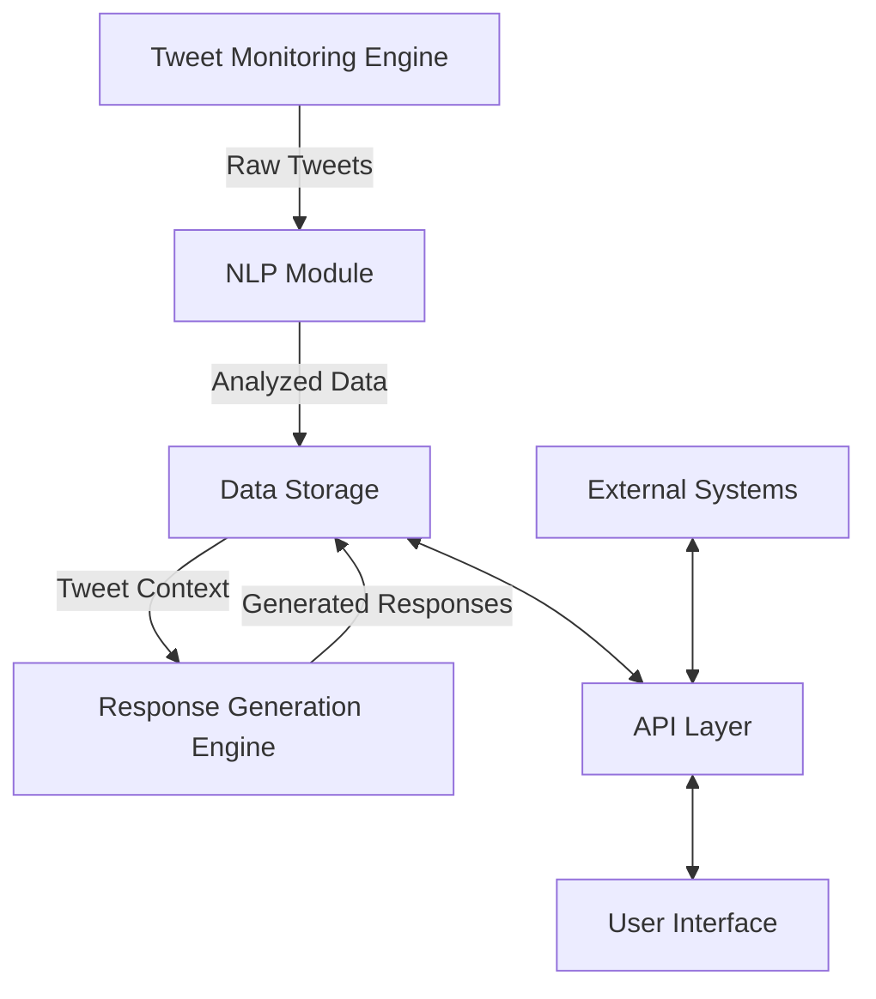

### Component Descriptions

1. Tweet Monitoring Engine
   - Implemented in Python
   - Utilizes Twitter's Streaming API
   - Deployed on Google Cloud Functions
   - Filters tweets based on predefined criteria

2. Natural Language Processing (NLP) Module
   - Python-based implementation
   - Leverages Google Cloud Natural Language API
   - Performs sentiment analysis and entity recognition
   - Assigns "Doubt Rating" to tweets

3. Data Storage and Management System
   - Google Cloud Firestore for structured data
   - Google Cloud Storage for media files
   - Implements data retention and backup policies

4. Response Generation Engine
   - Python-based LLM integration (e.g., GPT-4)
   - Contextual response generation
   - Deployed on Google Cloud AI Platform

5. User Interface
   - React with TypeScript
   - Tailwind CSS for styling
   - Responsive design for desktop and tablet
   - Real-time updates using WebSocket

6. API Layer
   - RESTful API implemented with Python (Flask)
   - Deployed on Google Cloud Run
   - Handles authentication and authorization
   - Provides endpoints for all system functions

### Key Features

- Real-time tweet monitoring and analysis
- Automated sentiment scoring and doubt rating
- Structured data storage in Notion database
- AI-powered response generation
- User-friendly web interface for system management
- Customizable popularity thresholds and context management
- Analytics and reporting capabilities
- Robust error handling and logging
- GDPR-compliant data handling

### Integration Points

- Twitter API: For real-time tweet monitoring
- Notion API: For structured data storage and team collaboration
- LLM Provider API: For generating contextual responses
- Google Cloud Services: For hosting, storage, and various cloud functions

### Scalability and Performance

The system is designed to handle a high volume of tweets and concurrent users. It leverages Google Cloud Platform's auto-scaling capabilities to ensure performance under varying loads. The use of serverless technologies like Cloud Functions and Cloud Run allows for efficient resource utilization and cost management.

### Security and Compliance

- Implements OAuth 2.0 and JWT for authentication
- Utilizes Google Cloud IAM for access control
- Encrypts data at rest and in transit
- Adheres to GDPR requirements for data handling and user privacy
- Implements audit logging for all critical operations

This system overview provides a high-level description of the Code Skeptic Scanner, outlining its key components, architecture, features, and technical considerations. The system is designed to be robust, scalable, and compliant with relevant regulations, while providing a powerful tool for monitoring and engaging with the discourse around AI coding tools on social media.

## SYSTEM ARCHITECTURE

### PROGRAMMING LANGUAGES

The Code Skeptic Scanner will utilize the following programming languages:

1. TypeScript
   - Used for: Frontend development (React components)
   - Justification: Provides strong typing, enhancing code quality and maintainability in complex UI components.

2. JavaScript
   - Used for: Frontend development (React components, utility functions)
   - Justification: Necessary for React ecosystem and browser compatibility.

3. Python
   - Used for: Backend services, data processing, and API development
   - Justification: Excellent for data processing, machine learning integration, and rapid development of backend services.

4. SQL
   - Used for: Database queries (when interacting with relational databases)
   - Justification: Efficient for complex data queries and reporting.

5. HTML/CSS
   - Used for: Frontend markup and styling
   - Justification: Essential for web-based user interface development.

| Language   | Primary Use Case           | Justification                                            |
|------------|----------------------------|----------------------------------------------------------|
| TypeScript | Frontend (React)           | Strong typing, enhanced maintainability                  |
| JavaScript | Frontend (React)           | React ecosystem compatibility                            |
| Python     | Backend, Data Processing   | Versatile, excellent for ML and data processing          |
| SQL        | Database Queries           | Efficient for complex data operations                    |
| HTML/CSS   | Frontend Markup & Styling  | Essential for web UI development                         |

### HIGH-LEVEL ARCHITECTURE DIAGRAM

The following diagram provides an overview of the Code Skeptic Scanner's high-level architecture:

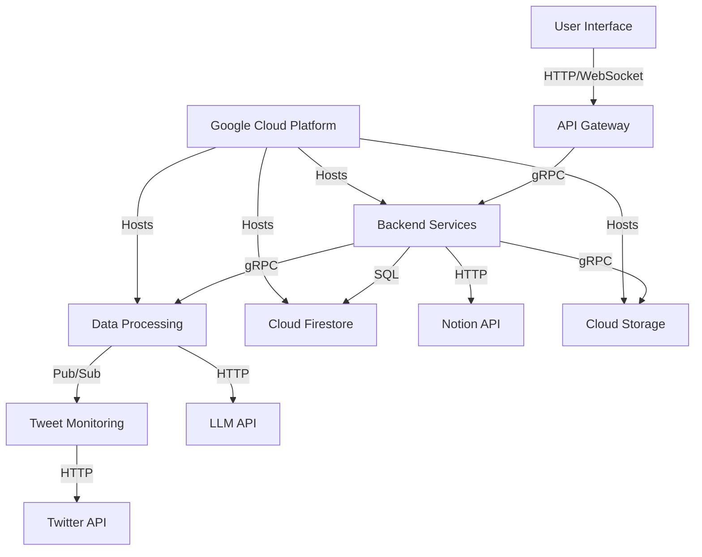

This high-level architecture diagram illustrates the main components of the Code Skeptic Scanner and their interactions. The system is primarily hosted on Google Cloud Platform, utilizing various cloud services for scalability and reliability.

### COMPONENT DIAGRAMS

#### Frontend Components

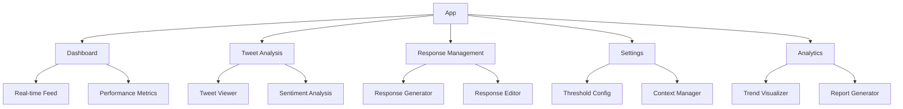

#### Backend Components

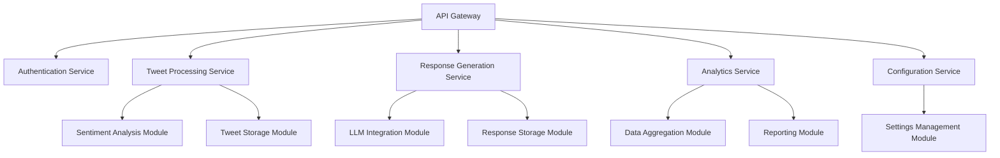

### SEQUENCE DIAGRAMS

#### Tweet Processing Sequence

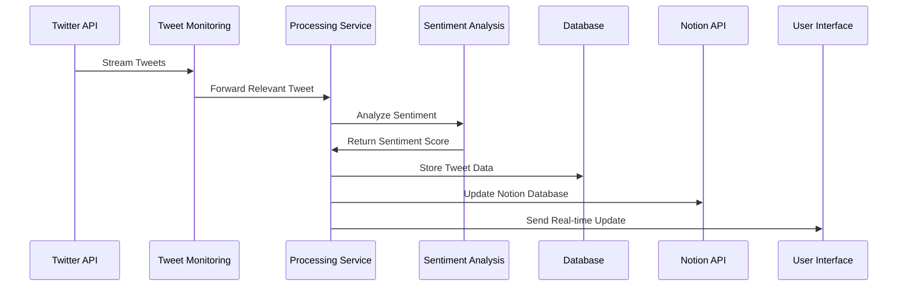

#### Response Generation Sequence

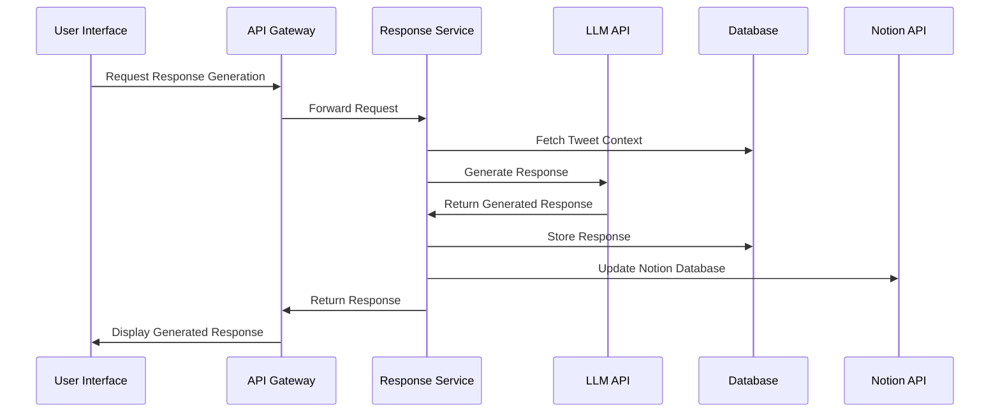

### DATA-FLOW DIAGRAM

The following diagram illustrates how information flows through the Code Skeptic Scanner system:

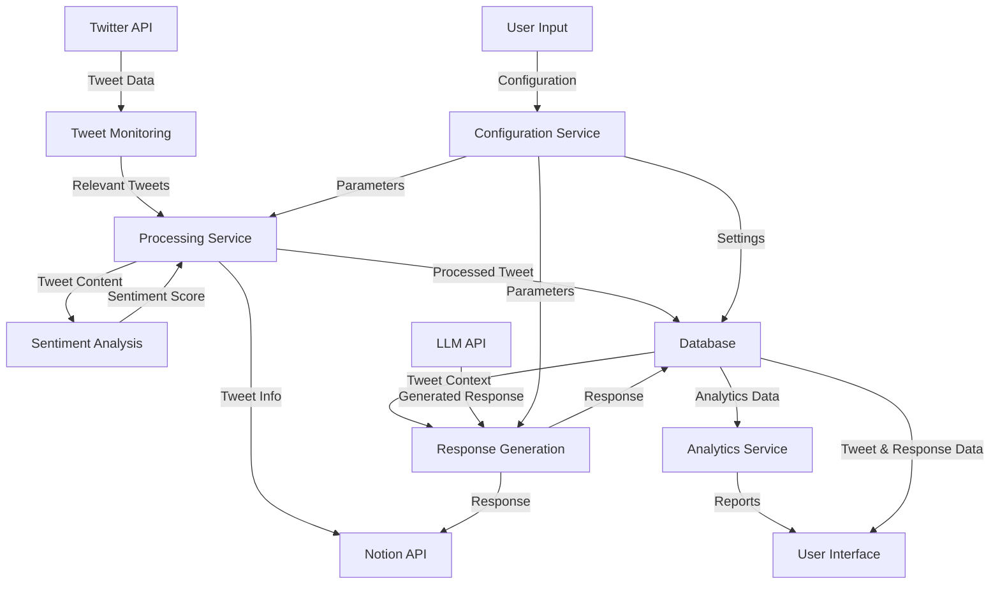

This data-flow diagram shows how information moves through the Code Skeptic Scanner, from the initial tweet ingestion to the final display of processed data and generated responses in the user interface. It highlights the central role of the database in storing and providing data to various system components, as well as the integration with external services like the Twitter API, Notion API, and LLM API.

## SYSTEM DESIGN

### PROGRAMMING LANGUAGES

The Code Skeptic Scanner will utilize the following programming languages:

1. TypeScript
   - Used for: Frontend development (React components)
   - Justification: Provides strong typing, enhancing code quality and maintainability in complex UI components.

2. JavaScript
   - Used for: Frontend development (React components, utility functions)
   - Justification: Necessary for React ecosystem and browser compatibility.

3. Python
   - Used for: Backend services, data processing, and API development
   - Justification: Excellent for data processing, machine learning integration, and rapid development of backend services.

4. SQL
   - Used for: Database queries (when interacting with relational databases)
   - Justification: Efficient for complex data queries and reporting.

5. HTML/CSS
   - Used for: Frontend markup and styling
   - Justification: Essential for web-based user interface development.

| Language   | Primary Use Case           | Justification                                            |
|------------|----------------------------|----------------------------------------------------------|
| TypeScript | Frontend (React)           | Strong typing, enhanced maintainability                  |
| JavaScript | Frontend (React)           | React ecosystem compatibility                            |
| Python     | Backend, Data Processing   | Versatile, excellent for ML and data processing          |
| SQL        | Database Queries           | Efficient for complex data operations                    |
| HTML/CSS   | Frontend Markup & Styling  | Essential for web UI development                         |

### DATABASE DESIGN

The Code Skeptic Scanner will primarily use Google Cloud Firestore, a NoSQL document database, for its flexibility and scalability. The database design will consist of the following collections:

1. Tweets
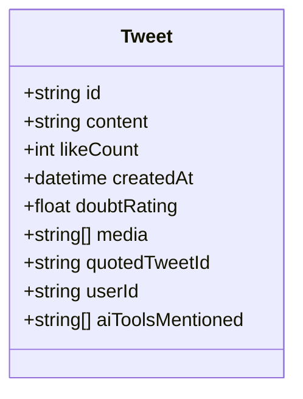

2. Users
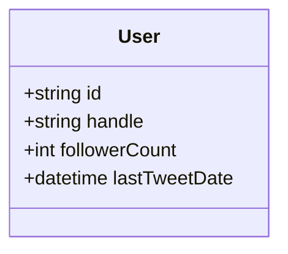

3. AITools
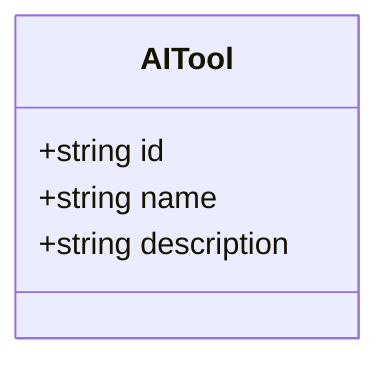

4. Responses
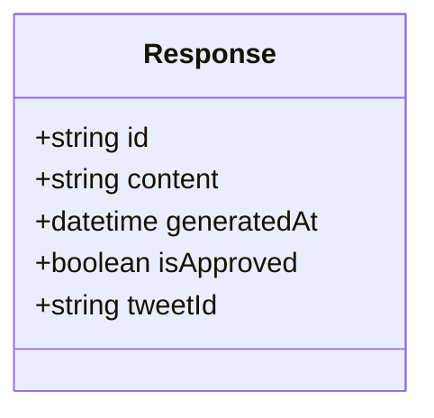

5. Settings
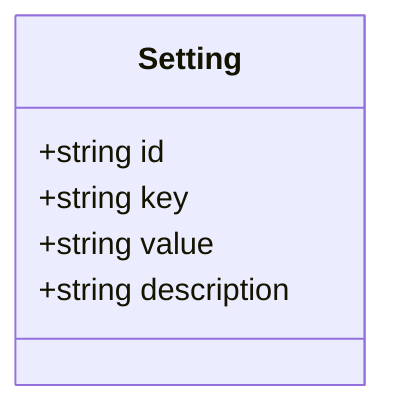

### API DESIGN

The Code Skeptic Scanner will use a RESTful API design implemented with Python and Flask, deployed on Google Cloud Run. The API will include the following endpoints:

1. Tweet Management
   - GET /api/tweets - Retrieve tweets (with pagination)
   - GET /api/tweets/{id} - Retrieve a specific tweet
   - POST /api/tweets/analyze - Trigger analysis for a specific tweet

2. Response Management
   - GET /api/responses - Retrieve generated responses (with pagination)
   - GET /api/responses/{id} - Retrieve a specific response
   - POST /api/responses - Generate a new response
   - PUT /api/responses/{id} - Update a response (e.g., approve/reject)

3. Settings Management
   - GET /api/settings - Retrieve all settings
   - PUT /api/settings/{key} - Update a specific setting

4. Analytics
   - GET /api/analytics/trends - Retrieve trend data
   - GET /api/analytics/summary - Retrieve summary statistics

5. AI Tools
   - GET /api/aitools - Retrieve all AI tools
   - POST /api/aitools - Add a new AI tool
   - PUT /api/aitools/{id} - Update an AI tool

All API endpoints will require authentication using JWT tokens and will return data in JSON format.

### USER INTERFACE DESIGN

The Code Skeptic Scanner's user interface will be developed using React with TypeScript and styled using Tailwind CSS. The UI will be responsive and optimized for desktop and tablet devices. The main components of the UI include:

1. Dashboard
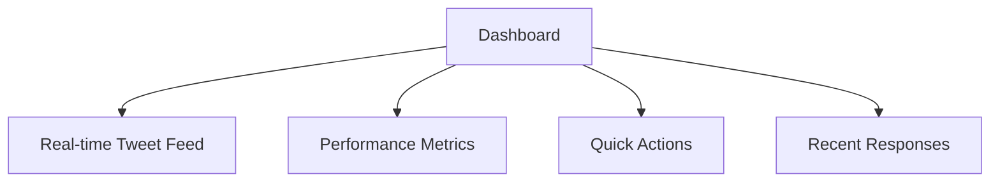

2. Tweet Analysis View
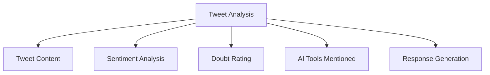

3. Response Management Interface
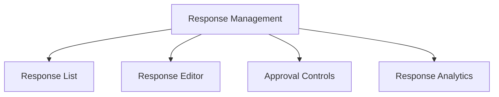

4. Settings and Configuration Panel
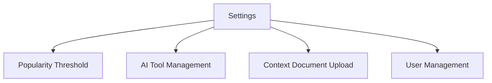

5. Analytics and Reporting Interface
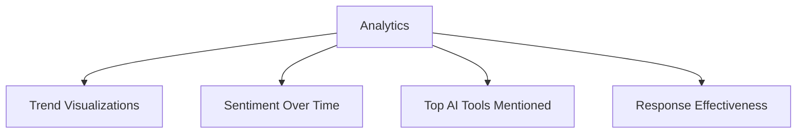

The UI will use a consistent color scheme and design language across all components, with a focus on usability and efficient information display. Interactive elements will provide immediate feedback, and data visualizations will be used to present complex information in an easily digestible format.

## TECHNOLOGY STACK

### PROGRAMMING LANGUAGES

The Code Skeptic Scanner will utilize the following programming languages:

| Language   | Primary Use Case           | Justification                                            |
|------------|----------------------------|----------------------------------------------------------|
| TypeScript | Frontend (React)           | Strong typing, enhanced maintainability                  |
| JavaScript | Frontend (React)           | React ecosystem compatibility                            |
| Python     | Backend, Data Processing   | Versatile, excellent for ML and data processing          |
| SQL        | Database Queries           | Efficient for complex data operations                    |
| HTML/CSS   | Frontend Markup & Styling  | Essential for web UI development                         |

### FRAMEWORKS AND LIBRARIES

The following frameworks and libraries will be used in the development of the Code Skeptic Scanner:

| Category          | Technology                | Purpose                                             |
|-------------------|---------------------------|-----------------------------------------------------|
| Frontend          | React                     | UI component library                                |
|                   | Tailwind CSS              | Utility-first CSS framework for styling             |
|                   | React Query               | Data fetching and state management                  |
|                   | React Router              | Client-side routing                                 |
|                   | Chart.js                  | Data visualization                                  |
| Backend           | Flask                     | Lightweight web framework for Python                |
|                   | SQLAlchemy                | ORM for database operations                         |
|                   | Celery                    | Distributed task queue for background jobs          |
| Data Processing   | pandas                    | Data manipulation and analysis                      |
|                   | NumPy                     | Numerical computing                                 |
|                   | scikit-learn              | Machine learning algorithms                         |
| Testing           | Jest                      | JavaScript testing framework                        |
|                   | Pytest                    | Python testing framework                            |
| DevOps            | Docker                    | Containerization                                    |
|                   | Kubernetes                | Container orchestration                             |

### DATABASES

The Code Skeptic Scanner will employ the following database systems:

1. Google Cloud Firestore
   - Primary database for storing tweet data, user information, and system configurations
   - NoSQL document database offering real-time synchronization and automatic scaling

2. Google Cloud Storage
   - Object storage for media files (images, videos) associated with tweets
   - Provides high durability and availability for large-scale data storage

3. Google Cloud Memorystore (Redis)
   - In-memory data store for caching frequently accessed data
   - Improves system performance by reducing database load

### THIRD-PARTY SERVICES

The following external services and APIs will be integrated into the Code Skeptic Scanner:

1. Twitter API
   - Purpose: Real-time tweet monitoring and data retrieval
   - Endpoints: Streaming API, REST API for user data

2. Notion API
   - Purpose: Integration with Notion for structured data storage and team collaboration
   - Endpoints: Database operations, page creation/editing

3. OpenAI GPT-4 API
   - Purpose: Natural language processing and response generation
   - Endpoints: Text completion, semantic analysis

4. Google Cloud Services
   - Cloud Functions: Serverless compute for event-driven tasks
   - Cloud Pub/Sub: Message queuing for distributed systems
   - Cloud Natural Language API: Advanced NLP capabilities
   - Cloud Translation API: Multi-language support (if required)

5. SendGrid API
   - Purpose: Transactional email service for notifications and alerts
   - Endpoints: Email sending, template management

6. Sentry.io
   - Purpose: Error tracking and performance monitoring
   - Endpoints: Error reporting, real-time alerts

7. Auth0
   - Purpose: Authentication and authorization service
   - Endpoints: User management, SSO, social login integration

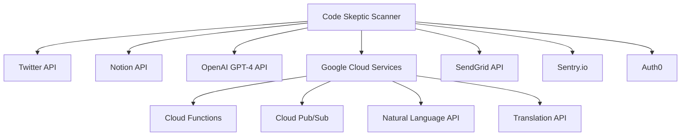

This technology stack leverages modern, scalable, and efficient technologies to build a robust and performant Code Skeptic Scanner system. The combination of TypeScript and React for the frontend, Python for the backend, and Google Cloud services for infrastructure provides a solid foundation for developing a responsive, scalable, and maintainable application.

## SECURITY CONSIDERATIONS

### AUTHENTICATION AND AUTHORIZATION

The Code Skeptic Scanner will implement a robust authentication and authorization system to ensure secure access to the application and its resources.

1. Authentication:
   - OAuth 2.0 will be used for user authentication, integrated with Google Cloud Identity Platform.
   - Multi-factor authentication (MFA) will be mandatory for all administrative accounts.
   - JSON Web Tokens (JWT) will be used for maintaining user sessions.

2. Authorization:
   - Role-Based Access Control (RBAC) will be implemented to manage user permissions.
   - The following roles will be defined:
     - Admin: Full access to all system features and configurations
     - Analyst: Access to tweet analysis and response generation
     - Viewer: Read-only access to dashboards and reports

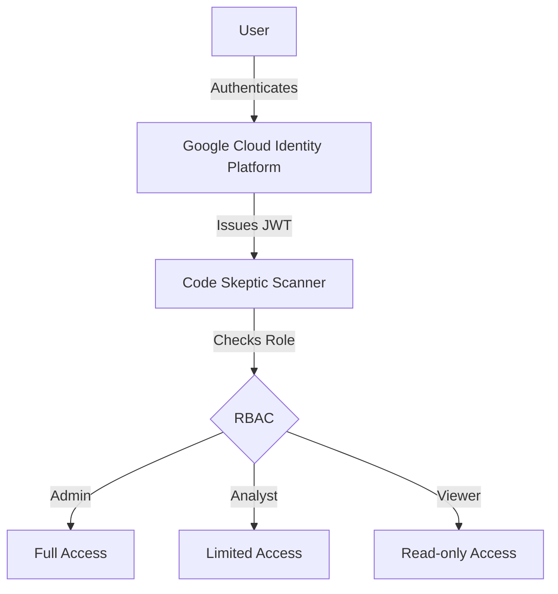

3. API Security:
   - API access will be controlled using JWT tokens with a maximum lifespan of 1 hour.
   - API rate limiting will be implemented to prevent abuse.

### DATA SECURITY

The Code Skeptic Scanner will employ multiple layers of security to protect sensitive information:

1. Data Encryption:
   - All data at rest will be encrypted using AES-256 encryption in Google Cloud Storage and Cloud Firestore.
   - All data in transit will be encrypted using TLS 1.3 or higher.

2. Data Classification:
   - Data will be classified into three categories: Public, Internal, and Confidential.
   - Access controls and encryption levels will be applied based on data classification.

| Data Classification | Example | Access Control | Encryption |
|---------------------|---------|----------------|------------|
| Public | Tweet content | All authenticated users | In transit |
| Internal | Sentiment analysis results | Analysts and Admins | At rest and in transit |
| Confidential | User credentials | Admins only | At rest and in transit with additional key management |

3. Data Masking:
   - Sensitive user information will be masked in logs and non-production environments.

4. Data Retention and Deletion:
   - Automated data retention policies will be implemented to ensure data is not kept longer than necessary.
   - Secure data deletion procedures will be in place for removing data upon request or after the retention period.

### SECURITY PROTOCOLS

The following security protocols will be implemented to maintain system security:

1. Network Security:
   - Virtual Private Cloud (VPC) will be used to isolate the application's network resources.
   - Cloud NAT will be implemented to control egress traffic.
   - Web Application Firewall (WAF) will be deployed to protect against common web exploits.

2. Monitoring and Logging:
   - Google Cloud Security Command Center will be used for continuous security monitoring and threat detection.
   - Comprehensive logging will be implemented using Google Cloud Logging.
   - Security logs will be retained for a minimum of 90 days for audit purposes.

3. Vulnerability Management:
   - Regular vulnerability scans will be conducted using Google Cloud Security Scanner.
   - A responsible disclosure program will be established for reporting security vulnerabilities.

4. Incident Response:
   - An incident response plan will be developed and regularly updated.
   - Automated alerts will be configured for potential security incidents.

5. Secure Development Practices:
   - All developers will follow OWASP secure coding guidelines.
   - Regular security training will be provided to the development team.
   - Static code analysis tools will be integrated into the CI/CD pipeline.

6. Third-Party Security:
   - All third-party integrations will undergo a security assessment before implementation.
   - Regular security reviews of third-party services will be conducted.

7. Compliance:
   - The system will be designed to comply with GDPR and other relevant data protection regulations.
   - Regular security audits will be conducted to ensure ongoing compliance.

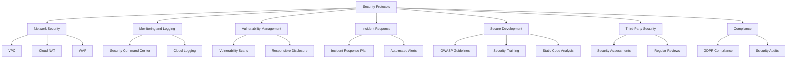

This comprehensive security approach ensures that the Code Skeptic Scanner is protected against a wide range of potential threats while maintaining compliance with relevant regulations. The use of Google Cloud services provides a robust foundation for implementing these security measures, while the custom development in TypeScript (React) and Python allows for fine-tuned control over application-specific security features.